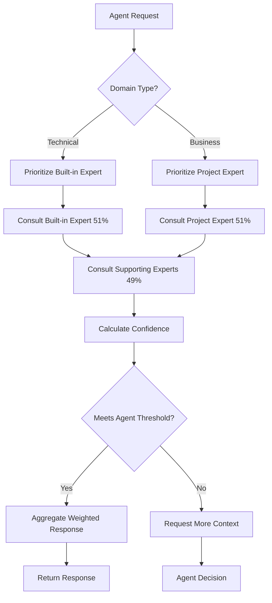

# Expert Priority System Guide

**Version**: 1.0  
**Last Updated**: January 2025  
**Status**: Active Configuration

## Overview

TappsCodingAgents uses a dual-layer expert architecture with automatic priority routing:

- **Built-in Experts** (16): Framework-controlled technical domain experts
- **Project Experts** (13): HomeIQ-specific business domain experts
- **Priority System**: Automatic routing based on domain type (technical vs business)

## Priority Rules

### 1. Built-in Experts (Technical Domains)

**Primary Authority**: 51% weight for technical domains  
**Domains**: Framework-defined technical domains  
**Status**: Immutable, framework-controlled

**When Built-in Experts Take Priority:**
- Domain matches technical domain (security, performance, testing, etc.)
- `prioritize_builtin=True` is set (default for technical domains)
- Query is about general technical best practices

**Example:**
```python
# Security domain - built-in expert gets 51% weight
result = await registry.consult(
    query="How to secure this API endpoint?",
    domain="security",
    prioritize_builtin=True  # Built-in expert prioritized
)
```

### 2. Project Experts (Business Domains)

**Primary Authority**: 51% weight for business domains  
**Domains**: HomeIQ-specific business domains  
**Status**: Configurable, project-controlled

**When Project Experts Take Priority:**
- Domain matches business domain (iot-home-automation, home-assistant, etc.)
- `prioritize_builtin=False` is set (default for business domains)
- Query is about HomeIQ-specific patterns or architecture

**Example:**
```python
# Home Assistant domain - project expert gets 51% weight
result = await registry.consult(
    query="How to integrate with Home Assistant WebSocket API?",
    domain="home-assistant",
    prioritize_builtin=False  # Project expert prioritized
)
```

## Domain Mapping Table

### Technical Domains → Built-in Experts

| Domain | Built-in Expert | Expert ID | Knowledge Base |
|--------|----------------|-----------|----------------|
| `security` | Security Expert | `expert-security` | 4 files (OWASP, vulnerabilities) |
| `performance-optimization` | Performance Expert | `expert-performance` | 8 files (optimization, caching) |
| `testing-strategies` | Testing Expert | `expert-testing` | 9 files (test patterns, coverage) |
| `code-quality-analysis` | Code Quality Expert | `expert-code-quality` | Framework-controlled |
| `software-architecture` | Software Architecture Expert | `expert-software-architecture` | Framework-controlled |
| `development-workflow` | DevOps Expert | `expert-devops` | Framework-controlled |
| `data-privacy-compliance` | Data Privacy Expert | `expert-data-privacy` | 10 files (GDPR, HIPAA) |
| `accessibility` | Accessibility Expert | `expert-accessibility` | 9 files (WCAG, ARIA) |
| `user-experience` | User Experience Expert | `expert-user-experience` | 8 files (UX principles) |
| `documentation-knowledge-management` | Documentation Expert | `expert-documentation` | Framework-controlled |
| `ai-agent-framework` | AI Agent Framework Expert | `expert-ai-frameworks` | Framework-controlled |
| `agent-learning` | Agent Learning Expert | `expert-agent-learning` | Framework-controlled |
| `observability-monitoring` | Observability Expert | `expert-observability` | 8 files (tracing, metrics) |
| `api-design-integration` | API Design Expert | `expert-api-design` | 8 files (REST, GraphQL) |
| `cloud-infrastructure` | Cloud Infrastructure Expert | `expert-cloud-infrastructure` | 8 files (K8s, serverless) |
| `database-data-management` | Database Expert | `expert-database` | 8 files (SQL, NoSQL) |

**Total**: 16 built-in experts covering 16 technical domains

### Business Domains → Project Experts

| Domain | Project Expert | Expert ID | Knowledge Base |
|--------|---------------|-----------|----------------|
| `iot-home-automation` | IoT & Home Automation Expert | `expert-iot` | 7 files |
| `time-series-analytics` | Time-Series Data & Analytics Expert | `expert-time-series` | 18 files |
| `ai-machine-learning` | AI & Machine Learning Expert | `expert-ai-ml` | 6 files |
| `microservices-architecture` | Microservices Architecture Expert | `expert-microservices` | 68 files |
| `security-privacy` | Security & Privacy Expert | `expert-security` | 2 files |
| `energy-management` | Energy Management Expert | `expert-energy` | 6 files |
| `frontend-ux` | Frontend & User Experience Expert | `expert-frontend` | 6 files |
| `home-assistant` | Home Assistant Expert | `expert-home-assistant` | 13 files |
| `automation-strategy` | Automation Strategy Expert | `expert-automation-strategy` | 6 files |
| `proactive-intelligence` | Proactive Intelligence Expert | `expert-proactive-intelligence` | 6 files |
| `smart-home-ux` | Smart Home User Experience Expert | `expert-smart-home-ux` | 5 files |
| `energy-economics` | Energy Economics Expert | `expert-energy-economics` | 5 files |
| `pattern-analytics` | Pattern Recognition & Analytics Expert | `expert-pattern-analytics` | 5 files |
| `device-ecosystem` | Device Ecosystem Expert | `expert-device-ecosystem` | 5 files |

**Total**: 13 project experts covering 13 business domains

### Overlap Domains → Priority Resolution

Some domains have overlap between built-in and project experts:

| Domain | Built-in Expert | Project Expert | Priority Resolution |
|--------|----------------|----------------|---------------------|
| `security` | `expert-security` (technical) | `expert-security` (business) | **Built-in takes precedence** for general security queries<br>**Project expert** for HomeIQ-specific security (device security, HA authentication) |
| `user-experience` | `expert-user-experience` (technical) | `expert-frontend` (business) | **Built-in** for general UX principles<br>**Project expert** for HomeIQ dashboard UX, React patterns |
| `microservices-architecture` | `expert-software-architecture` (technical) | `expert-microservices` (business) | **Project expert** takes precedence (HomeIQ-specific patterns, Epic 31 architecture) |

**Resolution Logic:**
1. **Technical queries** → Built-in expert (general best practices)
2. **HomeIQ-specific queries** → Project expert (HomeIQ patterns, Epic references)
3. **Domain matching** → Automatic routing based on domain type

## Consultation Flow

### Step-by-Step Process

```
1. Agent Request
   ↓
2. Determine Domain Type
   ├─ Technical Domain? → Prioritize Built-in Expert
   └─ Business Domain? → Prioritize Project Expert
   ↓
3. Consult Experts
   ├─ Primary Expert (51% weight)
   │   ├─ Built-in expert (if technical)
   │   └─ Project expert (if business)
   └─ Supporting Experts (49% weight)
       ├─ Other built-in experts (if relevant)
       └─ Other project experts (if relevant)
   ↓
4. Calculate Confidence
   ├─ Max Expert Confidence (40%)
   ├─ Agreement Level (30%)
   ├─ RAG Quality (20%)
   └─ Domain Relevance (10%)
   ↓
5. Check Agent Threshold
   ├─ Compare to agent-specific threshold
   └─ Meets threshold? → Use response
   ↓
6. Aggregate Responses
   └─ Weighted Answer (if confidence >= threshold)
```

### Detailed Flow Diagram



## Confidence Calculation

### Weighted Confidence Formula

```python
confidence = (
    max_confidence * 0.4 +      # Maximum expert confidence (40%)
    agreement_level * 0.3 +      # Expert agreement (30%)
    rag_quality * 0.2 +          # Knowledge base match quality (20%)
    domain_relevance * 0.1       # Domain relevance score (10%)
)
```

### Factors Explained

1. **Max Confidence (40%)**: Highest confidence from expert responses
   - Primary expert confidence
   - Supporting expert confidences
   - Maximum value used

2. **Agreement Level (30%)**: How well experts agree on the answer
   - Consensus between experts
   - Higher agreement = higher confidence
   - Disagreement reduces confidence

3. **RAG Quality (20%)**: Quality of knowledge base retrieval
   - Relevance of retrieved documents
   - Match quality to query
   - Knowledge base coverage

4. **Domain Relevance (10%)**: How relevant the domain is to the query
   - Domain matching score
   - Query-domain alignment
   - Context relevance

### Agent-Specific Thresholds

Each agent has a configurable confidence threshold:

| Agent | Default Threshold | Rationale |
|-------|------------------|-----------|
| Reviewer | 0.8 (80%) | High threshold for code reviews |
| Architect | 0.75 (75%) | High for architecture decisions |
| Implementer | 0.7 (70%) | Medium-high for code generation |
| Designer | 0.65 (65%) | Medium for design decisions |
| Tester | 0.7 (70%) | Medium-high for test generation |
| Ops | 0.75 (75%) | High for operations |
| Enhancer | 0.6 (60%) | Medium for enhancements |
| Analyst | 0.65 (65%) | Medium for analysis |
| Planner | 0.6 (60%) | Medium for planning |
| Debugger | 0.7 (70%) | Medium-high for debugging |
| Documenter | 0.5 (50%) | Lower for documentation |
| Orchestrator | 0.6 (60%) | Medium for orchestration |

**Configuration**: Set in `.tapps-agents/config.yaml`:

```yaml
expert:
  agent_confidence_thresholds:
    reviewer: 0.8
    architect: 0.75
    implementer: 0.7
    # ... other agents
```

## Examples

### Example 1: Technical Domain (Security)

**Query**: "How to prevent SQL injection in FastAPI?"

**Domain**: `security` (technical)

**Priority**: Built-in `expert-security` gets 51% weight

**Consultation**:
- Primary: Built-in Security Expert (51%)
- Supporting: Performance Expert, Code Quality Expert (49%)

**Result**: General security best practices from built-in expert

### Example 2: Business Domain (Home Assistant)

**Query**: "How to integrate with Home Assistant WebSocket API following Epic 31 patterns?"

**Domain**: `home-assistant` (business)

**Priority**: Project `expert-home-assistant` gets 51% weight

**Consultation**:
- Primary: Project Home Assistant Expert (51%)
- Supporting: IoT Expert, Microservices Expert (49%)

**Result**: HomeIQ-specific Home Assistant integration patterns

### Example 3: Overlap Domain (Security)

**Query**: "How to secure Home Assistant device authentication?"

**Domain**: `security-privacy` (business, but overlaps with technical security)

**Priority Resolution**:
- **Technical security** → Built-in Security Expert (general OWASP patterns)
- **HomeIQ-specific security** → Project Security Expert (device authentication, HA patterns)

**Consultation**:
- Primary: Project Security Expert (51%) - HomeIQ-specific
- Supporting: Built-in Security Expert (49%) - General patterns

**Result**: Combined response with HomeIQ-specific security patterns

## Configuration

### Expert Configuration (`.tapps-agents/experts.yaml`)

```yaml
experts:
  - expert_id: expert-security
    expert_name: Security & Privacy Expert
    primary_domain: security-privacy
    rag_enabled: true
    fine_tuned: false
```

### Priority Configuration (`.tapps-agents/config.yaml`)

```yaml
expert:
  agent_confidence_thresholds:
    reviewer: 0.8
    architect: 0.75
    # ... other agents
  weight_max_confidence: 0.35
  weight_agreement: 0.25
  weight_rag_quality: 0.2
  weight_domain_relevance: 0.1
  weight_project_context: 0.1
```

## Best Practices

### When to Use Built-in Experts

✅ **Use built-in experts for:**
- General technical best practices
- Framework-agnostic patterns
- Industry-standard approaches
- Security, performance, testing (general)

### When to Use Project Experts

✅ **Use project experts for:**
- HomeIQ-specific patterns
- Epic-specific architecture (Epic 31, etc.)
- Home Assistant integration
- Project-specific business logic

### When Both Are Consulted

✅ **Both experts consulted when:**
- Domain has overlap (security, UX, architecture)
- Query needs both general and specific knowledge
- Confidence calculation aggregates both responses

## Troubleshooting

### Low Confidence Scores

**Problem**: Expert consultation returns low confidence (< threshold)

**Solutions**:
1. Check domain matching - ensure correct domain specified
2. Verify knowledge base - ensure relevant files exist
3. Review query specificity - more specific queries get better matches
4. Check agent threshold - may be too high for the query type

### Wrong Expert Selected

**Problem**: Wrong expert (built-in vs project) is prioritized

**Solutions**:
1. Verify domain type - technical vs business
2. Check `prioritize_builtin` parameter
3. Review domain mapping table
4. Ensure correct domain name in query

### Overlap Resolution Issues

**Problem**: Unclear which expert to use for overlap domains

**Solutions**:
1. Use more specific domain name (e.g., `security-privacy` vs `security`)
2. Specify `prioritize_builtin` explicitly
3. Review overlap resolution table
4. Consider query context (general vs HomeIQ-specific)

## Summary

- **Built-in Experts**: 16 technical domain experts (51% weight for technical domains)
- **Project Experts**: 13 business domain experts (51% weight for business domains)
- **Automatic Routing**: Based on domain type (technical vs business)
- **Overlap Resolution**: Built-in for general, project for HomeIQ-specific
- **Confidence Calculation**: Weighted formula with 4 factors
- **Agent Thresholds**: Configurable per agent type

## References

- `.tapps-agents/experts.yaml` - Project expert configuration
- `.tapps-agents/config.yaml` - Expert system configuration
- `TappsCodingAgents/docs/BUILTIN_EXPERTS_GUIDE.md` - Built-in experts documentation
- `.tapps-agents/knowledge/` - Knowledge base files

