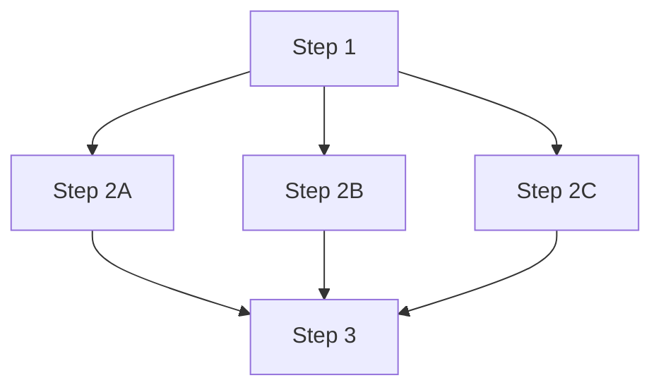
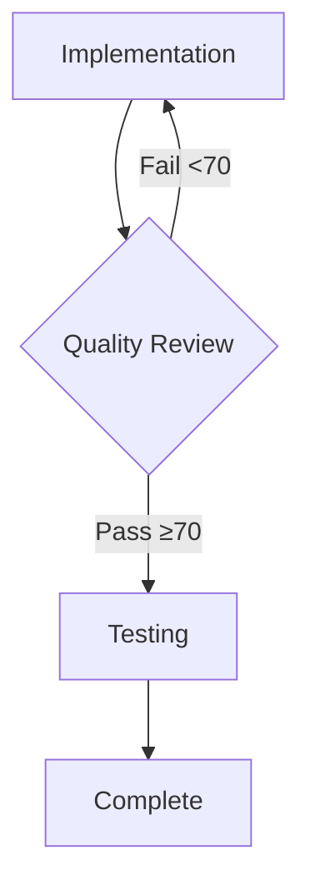

# TappsCodingAgents Integration Strategy for HomeIQ

**Version:** 1.0.0  
**Last Updated:** January 2025  
**Status:** Active

---

## Table of Contents

- [Overview](#overview)
- [Core Architecture & Mental Model](#core-architecture--mental-model)
- [Three-Tier Execution Strategy](#three-tier-execution-strategy)
- [Decision Framework](#decision-framework)
- [Pattern Recognition Guidelines](#pattern-recognition-guidelines)
- [Custom Workflow Creation Strategy](#custom-workflow-creation-strategy)
- [Integration Points & Best Practices](#integration-points--best-practices)
- [Anti-Patterns to Avoid](#anti-patterns-to-avoid)
- [Workflow Execution Patterns](#workflow-execution-patterns)
- [File Organization & Storage Strategy](#file-organization--storage-strategy)
- [Quality Assurance Integration](#quality-assurance-integration)
- [Context & Token Management](#context--token-management)
- [Implementation Checklist for Cursor](#implementation-checklist-for-cursor)
- [Examples & Use Cases](#examples--use-cases)

---

## Overview

This document provides comprehensive guidance for Cursor AI to effectively leverage TappsCodingAgents, Simple Mode, and workflow YAMLs for HomeIQ development. HomeIQ is a **30+ microservice architecture** requiring consistent, high-quality development practices.

### Key Principles

1. **Cursor is the Brain, TappsCodingAgents is the Hands** - Cursor provides LLM reasoning; TappsCodingAgents provides deterministic execution
2. **Workflow-First Development** - Prefer structured workflows over ad-hoc commands when patterns emerge
3. **Quality Gates are Non-Negotiable** - All code must meet HomeIQ quality thresholds (70+ overall, 7.0+ security/maintainability)
4. **Progressive Complexity** - Start with Simple Mode, escalate to direct agents, create custom workflows when patterns repeat

---

## Core Architecture & Mental Model

### The Integration Philosophy

**Cursor AI Role:**
- LLM reasoning and decision-making
- Natural language understanding and task planning
- Context management and code generation
- Quality assessment and refinement

**TappsCodingAgents Role:**
- Deterministic tool execution
- Structured workflow orchestration
- Quality scoring and gates
- Expert consultation (IoT, Time-Series, AI/ML, etc.)
- Test generation and execution

### Communication Model

```
┌─────────────┐         ┌──────────────────────┐         ┌─────────────────────┐
│   Cursor    │────────▶│  TappsCodingAgents   │────────▶│  Execution Tools    │
│   (Brain)   │◀────────│     (Hands)          │◀────────│  (Files, Tests, etc)│
└─────────────┘         └──────────────────────┘         └─────────────────────┘
     │                            │
     │                            │
     ├── Natural Language         ├── Structured Commands
     ├── Task Planning            ├── Workflow Execution
     ├── Context Management       ├── Quality Gates
     └── Code Generation          └── Expert Consultation
```

### HomeIQ Context

HomeIQ is a **production-ready, enterprise-grade platform** with:
- **30+ microservices** (plus InfluxDB = 31 containers)
- **Epic 31 Architecture**: Direct InfluxDB writes (enrichment-pipeline deprecated)
- **Hybrid Database**: InfluxDB (time-series) + SQLite (metadata)
- **Quality Standards**: 70+ overall score, 7.0+ security/maintainability
- **Current Gap**: 0% test coverage in core services (websocket-ingestion, ai-automation-service)

---

## Three-Tier Execution Strategy

### Tier 1: Simple Mode (Default Choice)

**When to Use:**
- ✅ Single-feature development
- ✅ Code reviews for single files
- ✅ Bug fixes in existing code
- ✅ Test generation for specific files
- ✅ Standard development workflows

**Commands:**
```bash
@simple-mode *build "Create new InfluxDB query endpoint"
@simple-mode *review services/websocket-ingestion/src/main.py
@simple-mode *fix services/data-api/src/main.py "Fix connection timeout"
@simple-mode *test services/data-api/src/main.py
```

**What It Does:**
- Automatically orchestrates multiple agents (enhancer → planner → architect → implementer → reviewer → tester)
- Enforces quality gates with loopbacks
- Generates documentation
- Consults HomeIQ domain experts

**Advantages:**
- Natural language interface
- Automatic orchestration
- Built-in quality gates
- Comprehensive workflow coverage

### Tier 2: Direct Agent Commands (Specialized Tasks)

**When to Use:**
- ✅ Specific agent capabilities needed (e.g., debugger for error analysis)
- ✅ Single-step operations (e.g., prompt enhancement only)
- ✅ Custom orchestration needed
- ✅ Integration with other tools

**Commands:**
```bash
# Direct agent commands
python -m tapps_agents.cli enhancer enhance "Add device health monitoring"
python -m tapps_agents.cli debugger analyze-error "Connection timeout in data-api"
python -m tapps_agents.cli reviewer review services/websocket-ingestion/src/main.py
python -m tapps_agents.cli tester test services/ai-automation-service/src/main.py
```

**What It Does:**
- Single agent execution
- Direct tool access
- No automatic orchestration
- Manual quality gate enforcement

**Advantages:**
- Fine-grained control
- Fast execution for single-step tasks
- Direct access to agent capabilities

**Disadvantages:**
- Manual orchestration required
- No automatic quality gates
- Must manually sequence multiple agents

### Tier 3: Custom Workflow YAMLs (Repeatable Patterns)

**When to Use:**
- ✅ **Pattern Recognition**: Same workflow used 3+ times
- ✅ **HomeIQ-Specific Patterns**: Microservice creation, service integration, quality audits
- ✅ **Multi-Service Operations**: Parallel reviews, coordinated deployments
- ✅ **Complex Orchestration**: Conditional logic, parallel execution, custom quality gates

**Workflow Examples:**
```bash
# Execute custom workflow
python -m tapps_agents.cli orchestrator workflow workflows/custom/homeiq-microservice-creation.yaml --prompt "Create new weather-api service"
```

**What It Does:**
- Defines step-by-step workflow in YAML
- Enforces dependencies and quality gates
- Supports parallel execution
- Repeatable across similar tasks

**Advantages:**
- **Single Source of Truth**: YAML defines the process
- **Version Control**: Workflow changes are tracked
- **Repeatability**: Same process every time
- **HomeIQ Patterns**: Encodes HomeIQ-specific practices (Epic 31 architecture, Docker patterns, etc.)

**HomeIQ Custom Workflows:**
- `homeiq-microservice-creation.yaml` - Create new microservice with Docker, InfluxDB integration
- `homeiq-service-integration.yaml` - Integrate service with existing infrastructure
- `homeiq-quality-audit.yaml` - Multi-service quality audit with parallel execution

See [HOMEIQ_CUSTOM_WORKFLOWS_GUIDE.md](./HOMEIQ_CUSTOM_WORKFLOWS_GUIDE.md) for details.

---

## Decision Framework

### Quick Decision Tree

```
User Request
    │
    ├─ Is it a single file operation?
    │   ├─ YES → Simple Mode (*review, *test, *fix)
    │   └─ NO → Continue
    │
    ├─ Is it a standard feature/bug fix?
    │   ├─ YES → Simple Mode (*build, *fix)
    │   └─ NO → Continue
    │
    ├─ Is it a single-step operation (enhance, debug)?
    │   ├─ YES → Direct Agent Command
    │   └─ NO → Continue
    │
    ├─ Is this pattern repeated 3+ times?
    │   ├─ YES → Create/Use Custom Workflow YAML
    │   └─ NO → Continue
    │
    ├─ Is it HomeIQ-specific (microservice, service integration)?
    │   ├─ YES → Use Custom Workflow (homeiq-*.yaml)
    │   └─ NO → Simple Mode
    │
    └─ Default → Simple Mode
```

### Detailed Decision Matrix

| Scenario | Tier | Rationale |
|----------|------|-----------|
| **Single file code review** | Simple Mode `*review` | Automatic quality scoring, expert consultation |
| **Bug fix in one service** | Simple Mode `*fix` | Structured debugging + testing + review |
| **New feature in one service** | Simple Mode `*build` | Full orchestration: planning → design → implementation → review → test |
| **Quick prompt enhancement** | Direct Agent `enhancer enhance-quick` | Single-step operation, no orchestration needed |
| **Error analysis only** | Direct Agent `debugger analyze-error` | Specific capability, no full workflow needed |
| **Create new microservice** | Custom Workflow `homeiq-microservice-creation.yaml` | Repeatable pattern, HomeIQ-specific (Docker, InfluxDB, etc.) |
| **Integrate new service** | Custom Workflow `homeiq-service-integration.yaml` | Repeatable pattern, Epic 31 architecture patterns |
| **Multi-service quality audit** | Custom Workflow `homeiq-quality-audit.yaml` | Parallel execution, coordinated reporting |
| **Same workflow 3+ times** | Create Custom Workflow | Pattern recognition - encode in YAML |

---

## Pattern Recognition Guidelines

### When to Create Custom Workflows

**Pattern Recognition Signals:**

1. **Frequency**: Same sequence of steps used 3+ times
   - Example: Creating microservices follows same pattern (Dockerfile, docker-compose.yml, InfluxDB integration, etc.)

2. **HomeIQ-Specific Patterns**: Patterns unique to HomeIQ architecture
   - Example: Epic 31 patterns (direct InfluxDB writes, no enrichment-pipeline)
   - Example: Service integration patterns (data-api queries, InfluxDB writes)

3. **Multi-Service Operations**: Coordinated operations across multiple services
   - Example: Quality audits across multiple services (parallel execution)
   - Example: Coordinated deployments

4. **Complex Conditional Logic**: Workflows with branches, gates, or loops
   - Example: Quality gates with loopbacks (if score < 70, retry implementation)

5. **Standardization Need**: Need to enforce consistent process
   - Example: All microservices must follow same structure and quality standards

### Pattern Recognition Process

1. **Identify Pattern**: Notice repeated sequence of operations
2. **Document Pattern**: Write down the steps in order
3. **Create Workflow YAML**: Convert to workflow YAML format
4. **Test Workflow**: Execute workflow on one instance
5. **Refine**: Adjust based on execution results
6. **Share**: Move to `workflows/presets/` if generally useful, keep in `workflows/custom/` if HomeIQ-specific

### HomeIQ Pattern Examples

**Pattern: Microservice Creation**
- Architecture design
- API design
- Dockerfile creation
- docker-compose.yml update
- InfluxDB integration (direct writes, Epic 31 pattern)
- Service implementation
- Unit tests
- Quality review (70+ score required)
- Documentation

**Pattern: Service Integration**
- Analyze existing services
- Design integration points
- Implement InfluxDB writes (direct, no enrichment-pipeline)
- Implement data-api queries
- Integration tests
- Quality review

**Pattern: Quality Audit**
- Parallel reviews across multiple services
- Test generation for services with low coverage
- Aggregate quality report
- Identify improvement priorities

---

## Custom Workflow Creation Strategy

### Workflow YAML Structure

HomeIQ custom workflows follow TappsCodingAgents workflow YAML format:

```yaml
workflow:
  id: homeiq-microservice-creation
  name: "HomeIQ Microservice Creation"
  description: "Create new microservice with HomeIQ patterns (Docker, InfluxDB, Epic 31)"
  version: "1.0.0"
  
  type: greenfield
  auto_detect: true
  
  settings:
    quality_gates: true
    code_scoring: true
    context_tier_default: 2
  
  steps:
    - id: architecture
      agent: architect
      action: design_system
      context_tier: 2
      requires: []
      creates:
        - architecture.md
      next: api_design
      
    - id: api_design
      agent: designer
      action: api_design
      context_tier: 2
      requires:
        - architecture.md
      creates:
        - api-specs/
      next: docker_setup
      
    - id: docker_setup
      agent: implementer
      action: write_code
      context_tier: 2
      instructions: |
        Create Dockerfile and update docker-compose.yml following HomeIQ patterns:
        - Use Python 3.12 base image
        - Include health check endpoint
        - Add to docker-compose.yml with appropriate port mapping
        - Follow Epic 31 architecture (direct InfluxDB writes, no enrichment-pipeline)
      requires:
        - architecture.md
      creates:
        - Dockerfile
        - docker-compose.yml
      next: implementation
      
    # ... more steps ...
    
    - id: review
      agent: reviewer
      action: review_code
      context_tier: 2
      requires:
        - src/
      scoring:
        enabled: true
        thresholds:
          overall_min: 70
          security_min: 7.0
          maintainability_min: 7.0
      gate:
        condition: "scoring.passed == true"
        on_pass: testing
        on_fail: implementation
      next: testing
```

### HomeIQ-Specific Workflow Guidelines

1. **Epic 31 Architecture Patterns**
   - Always use direct InfluxDB writes (no enrichment-pipeline)
   - Services write directly to InfluxDB
   - Query via data-api
   - Reference: `.cursor/rules/epic-31-architecture.mdc`

2. **Docker Patterns**
   - Python 3.12 base images
   - Health check endpoints required
   - Port mapping in docker-compose.yml
   - Environment variable management

3. **Quality Gates**
   - Overall score: 70+ (80+ for critical services)
   - Security: 7.0+
   - Maintainability: 7.0+
   - Test coverage: 80% target

4. **Service Communication**
   - InfluxDB: Direct writes, query via data-api
   - No service-to-service HTTP dependencies
   - Standalone services pattern

5. **Testing Requirements**
   - Unit tests for all services
   - Integration tests for InfluxDB operations
   - Health check endpoint tests

See [HOMEIQ_CUSTOM_WORKFLOWS_GUIDE.md](./HOMEIQ_CUSTOM_WORKFLOWS_GUIDE.md) for detailed examples.

---

## Integration Points & Best Practices

### Cursor Skills Integration

**Simple Mode as Primary Interface:**
- Cursor invokes `@simple-mode` for natural language commands
- Simple Mode orchestrates TappsCodingAgents agents
- Results returned to Cursor for display

**Direct Agent Access:**
- Cursor can invoke agents directly when needed
- Use for single-step operations or custom orchestration

**Workflow Execution:**
- Cursor can execute workflows via orchestrator agent
- Workflows defined in YAML provide deterministic execution

### File-Based Coordination

TappsCodingAgents uses file-based coordination for Cursor integration:

- `.cursor-skill-command.txt` - Command to execute
- `.cursor-skill-instructions.md` - Context and instructions
- Workflow state files - Track execution progress

### Expert Consultation

HomeIQ domain experts are automatically consulted:
- **IoT Expert**: Device management, Home Assistant integration
- **Time-Series Expert**: InfluxDB patterns, query optimization
- **AI/ML Expert**: AI automation service patterns
- **Security Expert**: Security best practices
- **Performance Expert**: Performance optimization
- **Testing Expert**: Test strategies
- **Documentation Expert**: Documentation standards

### Best Practices

1. **Always Use Simple Mode First** - Let it handle orchestration
2. **Escalate to Direct Agents** - When Simple Mode doesn't fit
3. **Create Custom Workflows** - When patterns emerge (3+ repetitions)
4. **Enforce Quality Gates** - Never skip quality checks
5. **Leverage Experts** - Automatic expert consultation is built-in
6. **Document Patterns** - Update workflows as patterns evolve

---

## Anti-Patterns to Avoid

### ❌ Anti-Pattern 1: Bypassing Simple Mode

**Don't:**
```python
# Direct code generation without Simple Mode
# Cursor generates code directly without quality checks
```

**Do:**
```bash
@simple-mode *build "Create new endpoint"
# Simple Mode orchestrates: planning → design → implementation → review → test
```

### ❌ Anti-Pattern 2: Ignoring Quality Gates

**Don't:**
```bash
# Skip quality review
@simple-mode *build "Feature" --skip-review
```

**Do:**
```bash
@simple-mode *build "Feature"
# Quality gates enforced automatically
```

### ❌ Anti-Pattern 3: Not Creating Workflows for Repeated Patterns

**Don't:**
```bash
# Manually repeating same sequence 5 times
@simple-mode *build "Service 1"
@simple-mode *build "Service 2"
# ... repeat for Services 3, 4, 5
```

**Do:**
```bash
# Create custom workflow after 3rd repetition
python -m tapps_agents.cli orchestrator workflow workflows/custom/homeiq-microservice-creation.yaml --prompt "Service 4"
```

### ❌ Anti-Pattern 4: Using Deprecated Patterns

**Don't:**
```python
# Using deprecated enrichment-pipeline pattern
await http_client.post("http://enrichment-pipeline:8002/events", event)
```

**Do:**
```python
# Epic 31: Direct InfluxDB writes
await influxdb_client.write(event)
```

### ❌ Anti-Pattern 5: Manual Orchestration When Simple Mode Exists

**Don't:**
```bash
python -m tapps_agents.cli planner plan "Feature"
python -m tapps_agents.cli architect design "Feature"
python -m tapps_agents.cli implementer implement "Feature"
# ... manual sequencing
```

**Do:**
```bash
@simple-mode *build "Feature"
# Automatic orchestration
```

---

## Workflow Execution Patterns

### Sequential Execution


**YAML:**
```yaml
steps:
  - id: step1
    next: step2
  - id: step2
    next: step3
  - id: step3
    next: step4
```

### Parallel Execution



**YAML:**
```yaml
steps:
  - id: step1
    next: [step2a, step2b, step2c]
  - id: step2a
    requires: [step1]
    next: step3
  - id: step2b
    requires: [step1]
    next: step3
  - id: step2c
    requires: [step1]
    next: step3
```

### Conditional Execution (Quality Gates)



**YAML:**
```yaml
steps:
  - id: implementation
    next: review
  - id: review
    agent: reviewer
    gate:
      condition: "scoring.passed == true"
      on_pass: testing
      on_fail: implementation
  - id: testing
    next: complete
```

---

## File Organization & Storage Strategy

### Workflow Storage

```
workflows/
├── presets/                    # Framework-provided workflows
│   ├── full-sdlc.yaml
│   ├── rapid-dev.yaml
│   ├── quick-fix.yaml
│   ├── maintenance.yaml
│   └── quality.yaml
│
└── custom/                     # HomeIQ-specific workflows
    ├── homeiq-microservice-creation.yaml
    ├── homeiq-service-integration.yaml
    └── homeiq-quality-audit.yaml
```

### Documentation Structure

```
docs/
├── CURSOR_TAPPS_AGENTS_INTEGRATION_STRATEGY.md  # This document
├── HOMEIQ_CUSTOM_WORKFLOWS_GUIDE.md             # Workflow creation guide
├── TAPPS_AGENTS_QUICK_REFERENCE.md              # Quick reference
├── TAPPS_AGENTS_USAGE_GUIDE.md                  # Usage guide (updated)
└── ...
```

### Cursor Rules

```
.cursor/rules/
├── simple-mode.mdc                              # Simple Mode guide (updated)
├── tapps-agents-workflow-selection.mdc          # Workflow selection guide
├── agent-capabilities.mdc                       # Agent capabilities
└── ...
```

---

## Quality Assurance Integration

### HomeIQ Quality Standards

**Minimum Thresholds:**
- **Overall Score**: 70+ (80+ for critical services)
- **Security**: 7.0+/10
- **Maintainability**: 7.0+/10
- **Test Coverage**: 80% target (currently 0% in core services - critical gap)

**Current Status:**
- ✅ data-api: 80.1/100 (PASSED)
- ❌ websocket-ingestion: 62.4/100 (FAILED - 0% test coverage)
- ❌ ai-automation-service: 57.7/100 (FAILED - 0% test coverage)

### Quality Gate Enforcement

**In Simple Mode:**
- Automatic quality scoring after implementation
- Loopback to implementation if score < 70
- Expert consultation for security/maintainability issues

**In Custom Workflows:**
```yaml
- id: review
  agent: reviewer
  scoring:
    enabled: true
    thresholds:
      overall_min: 70
      security_min: 7.0
      maintainability_min: 7.0
  gate:
    condition: "scoring.passed == true"
    on_pass: testing
    on_fail: implementation
```

### Quality Improvement Strategy

1. **Immediate Priority**: Add tests to websocket-ingestion and ai-automation-service (0% coverage)
2. **Maintainability**: Refactor services with scores < 5.0
3. **Linting/Type Checking**: Improve from 5.0/10 to 8.0+/10

---

## Context & Token Management

### Context Tiers

**Tier 1 (Minimal)**: Basic context, fast execution
- File-level context only
- Used for: Finalization, simple operations

**Tier 2 (Moderate)**: Standard context, balanced
- File + related files context
- Used for: Most operations, reviews, testing

**Tier 3 (Full)**: Comprehensive context, thorough
- Full service context + dependencies
- Used for: Architecture design, complex implementations

### Token Optimization

1. **Use Appropriate Context Tier**: Don't use Tier 3 for simple operations
2. **Leverage Workflow State**: Workflows track state, reducing context needs
3. **Expert Consultation**: Experts provide focused context, not full files
4. **Incremental Loading**: Load only needed files at each step

---

## Implementation Checklist for Cursor

### When User Requests Feature Development

- [ ] **Step 1**: Determine scope (single file, single service, multi-service)
- [ ] **Step 2**: Check for existing patterns (custom workflows)
- [ ] **Step 3**: Select execution tier (Simple Mode / Direct Agent / Custom Workflow)
- [ ] **Step 4**: Execute workflow
- [ ] **Step 5**: Verify quality gates passed
- [ ] **Step 6**: If pattern repeated 3+ times, propose custom workflow creation

### When User Requests Code Review

- [ ] **Step 1**: Use Simple Mode `*review` for automatic quality scoring
- [ ] **Step 2**: Check quality scores (70+ required)
- [ ] **Step 3**: If score < 70, use `*improve` to fix issues
- [ ] **Step 4**: Verify improvements meet thresholds

### When User Reports Bug

- [ ] **Step 1**: Use Simple Mode `*fix` for structured debugging
- [ ] **Step 2**: Verify fix with tests
- [ ] **Step 3**: Review fix quality (70+ required)
- [ ] **Step 4**: Confirm bug resolved

### When Pattern Emerges

- [ ] **Step 1**: Identify repeated sequence (3+ times)
- [ ] **Step 2**: Document pattern (steps, dependencies, quality gates)
- [ ] **Step 3**: Create workflow YAML in `workflows/custom/`
- [ ] **Step 4**: Test workflow on one instance
- [ ] **Step 5**: Refine based on results
- [ ] **Step 6**: Use workflow for future instances

---

## Examples & Use Cases

### Example 1: Create New Microservice

**User Request:**
> "Create a new weather-api service that fetches weather data and writes to InfluxDB"

**Cursor Decision:**
- ✅ Pattern: HomeIQ microservice creation (repeatable)
- ✅ Use: Custom Workflow `homeiq-microservice-creation.yaml`

**Execution:**
```bash
python -m tapps_agents.cli orchestrator workflow workflows/custom/homeiq-microservice-creation.yaml --prompt "Create weather-api service that fetches weather data and writes to InfluxDB"
```

**Workflow Executes:**
1. Architecture design (architect agent)
2. API design (designer agent)
3. Docker setup (Dockerfile, docker-compose.yml)
4. InfluxDB integration (Epic 31: direct writes)
5. Service implementation (implementer agent)
6. Quality review (70+ required)
7. Test generation (tester agent)
8. Documentation (documenter agent)

**Result:**
- New microservice with HomeIQ patterns
- Quality gates passed
- Tests generated
- Documentation created

### Example 2: Review Single File

**User Request:**
> "Review the websocket-ingestion service code quality"

**Cursor Decision:**
- ✅ Single file operation
- ✅ Use: Simple Mode `*review`

**Execution:**
```bash
@simple-mode *review services/websocket-ingestion/src/main.py
```

**Simple Mode Orchestrates:**
1. Reviewer agent reviews code
2. Quality scoring (5 metrics: complexity, security, maintainability, test coverage, performance)
3. Expert consultation (IoT, Time-Series, Security experts)
4. Improvement suggestions (if score < 70)

**Result:**
- Quality scores reported
- Issues identified (0% test coverage, low maintainability)
- Improvement suggestions provided

### Example 3: Fix Bug

**User Request:**
> "Fix the connection timeout error in data-api"

**Cursor Decision:**
- ✅ Bug fix in existing code
- ✅ Use: Simple Mode `*fix`

**Execution:**
```bash
@simple-mode *fix services/data-api/src/main.py "Fix connection timeout error"
```

**Simple Mode Orchestrates:**
1. Debugger agent analyzes error
2. Implementer agent applies fix
3. Tester agent generates/updates tests
4. Reviewer agent reviews fix (70+ required)

**Result:**
- Bug fixed
- Tests updated
- Quality review passed

### Example 4: Quick Prompt Enhancement

**User Request:**
> "Enhance this prompt: 'Add device health monitoring'"

**Cursor Decision:**
- ✅ Single-step operation (enhancement only)
- ✅ Use: Direct Agent Command

**Execution:**
```bash
python -m tapps_agents.cli enhancer enhance-quick "Add device health monitoring"
```

**Result:**
- Enhanced prompt with context, requirements, architecture guidance

### Example 5: Multi-Service Quality Audit

**User Request:**
> "Review quality across all HomeIQ services"

**Cursor Decision:**
- ✅ Multi-service operation
- ✅ Parallel execution needed
- ✅ Use: Custom Workflow `homeiq-quality-audit.yaml`

**Execution:**
```bash
python -m tapps_agents.cli orchestrator workflow workflows/custom/homeiq-quality-audit.yaml --prompt "Review all HomeIQ services"
```

**Workflow Executes:**
1. Parallel reviews across services (reviewer agent, parallel execution)
2. Test generation for services with low coverage (tester agent)
3. Aggregate quality report (orchestrator agent)

**Result:**
- Quality scores for all services
- Test generation for services with low coverage
- Aggregate report with improvement priorities

---

## Related Documentation

- [HOMEIQ_CUSTOM_WORKFLOWS_GUIDE.md](./HOMEIQ_CUSTOM_WORKFLOWS_GUIDE.md) - Detailed guide on creating HomeIQ custom workflows
- [TAPPS_AGENTS_QUICK_REFERENCE.md](./TAPPS_AGENTS_QUICK_REFERENCE.md) - Quick reference for common decisions
- [TAPPS_AGENTS_USAGE_GUIDE.md](./TAPPS_AGENTS_USAGE_GUIDE.md) - Usage guide with examples
- [.cursor/rules/tapps-agents-workflow-selection.mdc](../.cursor/rules/tapps-agents-workflow-selection.mdc) - Workflow selection Cursor rule
- [.cursor/rules/simple-mode.mdc](../.cursor/rules/simple-mode.mdc) - Simple Mode guide
- [.cursor/rules/epic-31-architecture.mdc](../.cursor/rules/epic-31-architecture.mdc) - Epic 31 architecture patterns

---

**Version History:**
- **1.0.0** (January 2025) - Initial version for HomeIQ

