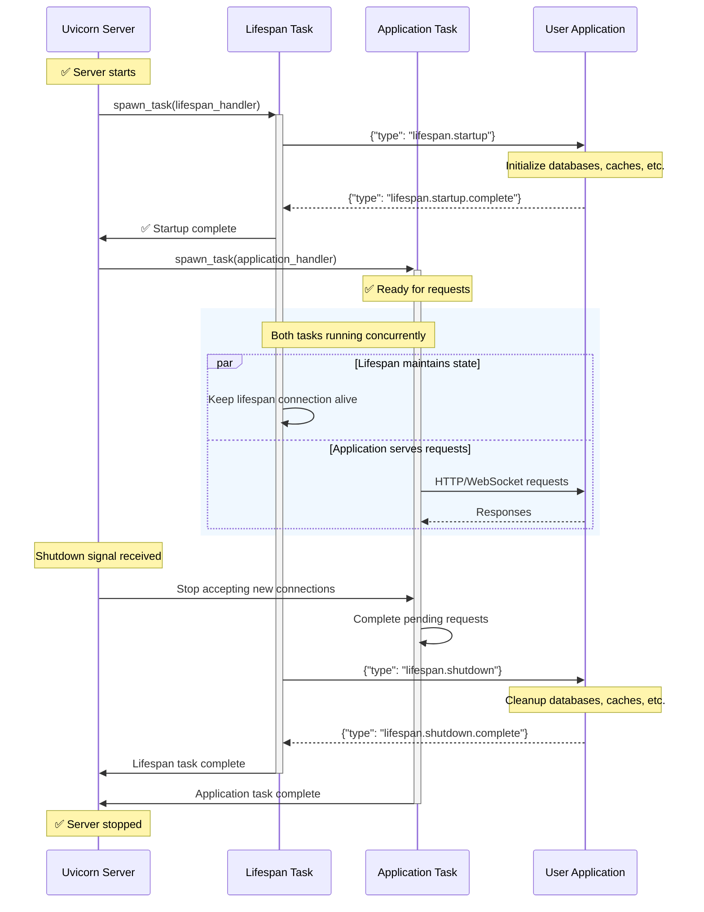

### Uvicorn Lifespan Architecture Diagram

A Mermaid sequence diagram illustrating the Uvicorn lifespan architecture. It shows the interaction between the Uvicorn Server, Lifespan Task, Application Task, and the User Application during startup, concurrent operation, and shutdown phases.



### ASGI Application with Lifespan Protocol

A minimal ASGI application demonstrating the implementation of the lifespan protocol for startup and shutdown events. It handles 'lifespan.startup' and 'lifespan.shutdown' messages, printing messages to the console during these phases. It also handles basic HTTP requests.

```python
async def app(scope, receive, send):
    if scope['type'] == 'lifespan':
        while True:
            message = await receive()
            if message['type'] == 'lifespan.startup':
                print("Application is starting up...")
                await send({'type': 'lifespan.startup.complete'})
            elif message['type'] == 'lifespan.shutdown':
                print("Application is shutting down...")
                await send({'type': 'lifespan.shutdown.complete'})
                return
    elif scope['type'] == 'http':
        await send({
            'type': 'http.response.start',
            'status': 200,
            'headers': [(b'content-type', b'text/plain')],
        })
        await send({'type': 'http.response.body', 'body': b'Hello, World!'})
    else:
        raise RuntimeError("This server doesn't support WebSocket.")
```

### Request and Response Body Handling

Covers response completion, `Expect: 100-Continue` header handling, and `HEAD` request processing.

```APIDOC
Response Completion:
  - Uvicorn stops buffering request body after response is sent.
  - Subsequent `receive` calls return `http.disconnect`.

Expect: 100-Continue:
  - Uvicorn sends `100 Continue` confirmation only if ASGI app calls `receive` to read request body.
  - Proxy configurations might not forward this header.

HEAD Requests:
  - Uvicorn strips response body for `HEAD` requests.
  - Applications should treat `HEAD` like `GET` for consistent headers.
```

### HTTP Scope Example

Illustrates the structure of the 'scope' dictionary for an incoming HTTP request. It includes details like the request method, path, headers, and server information.

```python
{
    'type': 'http',
    'scheme': 'http',
    'root_path': '',
    'server': ('127.0.0.1', 8000),
    'http_version': '1.1',
    'method': 'GET',
    'path': '/',
    'headers': [
        (b'host', b'127.0.0.1:8000'),
        (b'user-agent', b'curl/7.51.0'),
        (b'accept', b'*/*')
    ]
}
```

### Alternative ASGI Servers

Demonstrates how to install and run alternative ASGI servers like Daphne and Hypercorn. These servers offer different features and support various async frameworks.

```shell
pip install daphne
daphne app:App
```

```shell
pip install hypercorn
hypercorn app:App
```

### Basic ASGI Application

A simple ASGI application that responds with 'Hello, world!' to HTTP requests. It demonstrates the basic structure of an ASGI application, including handling the 'http.response.start' and 'http.response.body' events.

```python
async def app(scope, receive, send):
    assert scope['type'] == 'http'

    await send({
        'type': 'http.response.start',
        'status': 200,
        'headers': [
            (b'content-type', b'text/plain'),
        ],
    })
    await send({
        'type': 'http.response.body',
        'body': b'Hello, world!',
    })
```

### Serve Uvicorn Documentation Locally

Starts a local server to preview changes to the Uvicorn documentation. Documentation files are located in the `docs/` folder.

```shell
$ scripts/docs serve
```

### Function-Based ASGI Application

An example of a basic ASGI application implemented as an asynchronous function. It asserts the connection type is 'http' and outlines where application logic would reside.

```python
async def app(scope, receive, send):
    assert scope['type'] == 'http'
    ...
```

### Uvicorn Release Notes

This section summarizes the changes made in each Uvicorn release, including added features, bug fixes, deprecations, and removals. It provides a version history and highlights key updates.

```python
## 0.35.0 (June 28, 2025)

### Added

* Add `WebSocketsSansIOProtocol` (#2540)

### Changed

* Refine help message for option `--proxy-headers` (#2653)

## 0.34.3 (June 1, 2025)

### Fixed

* Don't include `cwd()` when non-empty `--reload-dirs` is passed (#2598)
* Apply `get_client_addr` formatting to WebSocket logging (#2636)

## 0.34.2 (April 19, 2025)

### Fixed

* Flush stdout buffer on Windows to trigger reload (#2604)

## 0.34.1 (April 13, 2025)

### Deprecated

* Deprecate `ServerState` in the main module (#2581)

## 0.34.0 (December 15, 2024)

### Added

* Add `content-length` to 500 response in `wsproto` implementation (#2542)

### Removed

* Drop support for Python 3.8 (#2543)

## 0.33.0 (December 14, 2024)

### Removed

* Remove `WatchGod` support for `--reload` (#2536)

## 0.32.1 (November 20, 2024)

### Fixed

* Drop ASGI spec version to 2.3 on HTTP scope (#2513)
* Enable httptools lenient data on `httptools >= 0.6.3` (#2488)

## 0.32.0 (October 15, 2024)

### Added

* Officially support Python 3.13 (#2482)
* Warn when `max_request_limit` is exceeded (#2430)

## 0.31.1 (October 9, 2024)

### Fixed

* Support WebSockets 0.13.1 (#2471)
* Restore support for `[*]` in trusted hosts (#2480)
* Add `PathLike[str]` type hint for `ssl_keyfile` (#2481)

## 0.31.0 (September 27, 2024)

### Added

Improve `ProxyHeadersMiddleware` (#2468) and (#2231):

- Fix the host for requests from clients running on the proxy server itself.
- Fallback to host that was already set for empty x-forwarded-for headers.
- Also allow to specify IP Networks as trusted hosts. This greatly simplifies deployments
  on docker swarm/kubernetes, where the reverse proxy might have a dynamic IP.
    - This includes support for IPv6 Address/Networks.

## 0.30.6 (August 13, 2024)

### Fixed

- Don't warn when upgrade is not WebSocket and depedencies are installed (#2360)

## 0.30.5 (August 2, 2024)

### Fixed

- Don't close connection before receiving body on H11 (#2408)

## 0.30.4 (July 31, 2024)

### Fixed

- Close connection when `h11` sets client state to `MUST_CLOSE` (#2375)

## 0.30.3 (July 20, 2024)

### Fixed

- Suppress `KeyboardInterrupt` from CLI and programmatic usage (#2384)
- `ClientDisconnect` inherits from `OSError` instead of `IOError` (#2393)

## 0.30.2 (July 20, 2024)

### Added

- Add `reason` support to [`websocket.disconnect`](https://asgi.readthedocs.io/en/latest/specs/www.html#disconnect-receive-event-ws) event (#2324)

### Fixed

- Iterate subprocesses in-place on the process manager (#2373)

## 0.30.1 (June 2, 2024)

### Fixed

- Allow horizontal tabs `\t` in response header values (#2345)

## 0.30.0 (May 28, 2024)

### Added

- New multiprocess manager (#2183)
- Allow `ConfigParser` or a `io.IO[Any]` on `log_config` (#1976)

### Fixed

- Suppress side-effects of signal propagation (#2317)
- Send `content-length` header on 5xx (#2304)

### Deprecated

- Deprecate the `uvicorn.workers` module (#2302)

## 0.29.0 (March 19, 2024)

### Added

- Cooperative signal handling (#1600)

## 0.28.1 (March 19, 2024)

### Fixed

- Revert raise `ClientDisconnected` on HTTP (#2276)

## 0.28.0 (March 9, 2024)

### Added

- Raise `ClientDisconnected` on `send()` when client disconnected (#2220)

### Fixed

- Except `AttributeError` on `sys.stdin.fileno()` for Windows IIS10 (#1947)
- Use `X-Forwarded-Proto` for WebSockets scheme when the proxy provides it (#2258)

## 0.27.1 (February 10, 2024)

- Fix spurious LocalProtocolError errors when processing pipelined requests (#2243)

## 0.27.0.post1 (January 29, 2024)

### Fixed

- Fix nav overrides for newer version of Mkdocs Material (#2233)

## 0.27.0 (January 22, 2024)

### Added

- Raise `ClientDisconnect(IOError)` on `send()` when client disconnected (#2218)
- Bump ASGI WebSocket spec version to 2.4 (#2221)

## 0.26.0 (January 16, 2024)

### Changed

- Update `--root-path` to include the root path prefix in the full ASGI `path` as per the ASGI spec (#2213)
- Use `__future__.annotations` on some internal modules (#2199)

## 0.25.0 (December 17, 2023)

### Added

- Support the WebSocket Denial Response ASGI extension (#1916)

### Fixed

- Allow explicit hidden file paths on `--reload-include` (#2176)
- Properly annotate `uvicorn.run()` (#2158)

## 0.24.0.post1 (November 6, 2023)

### Fixed

- Revert mkdocs-material from 9.1.21 to 9.2.6 (#2148)

## 0.24.0 (November 4, 2023)

### Added

- Support Python 3.12 (#2145)
- Allow setting `app` via environment variable `UVICORN_APP` (#2106)

## 0.23.2 (July 31, 2023)

### Fixed

- Maintain the same behavior of `websockets` from 10.4 on 11.0 (#2061)

## 0.23.1 (July 18, 2023)

### Fixed

- Add `typing_extensions` for Python 3.10 and lower (#2053)

## 0.23.0 (July 10, 2023)

### Added

- Add `--ws-max-queue` parameter WebSockets (#2033)

### Removed

- Drop support for Python 3.7 (#1996)
- Remove `asgiref` as typing dependency (#1999)
```

### FastAPI Gold Sponsor Display

This snippet displays information about a Gold Sponsor, FastAPI, including its logo and a brief description. It's structured using HTML with inline styling for presentation.

```HTML
<div style="display: flex; flex-direction: column; gap: 3rem; margin: 2rem 0;">
    <div>
        <h3 style="text-align: center; color: #ffd700; margin-bottom: 1.5rem;">🏆 Gold Sponsors</h3>
        <div style="display: flex; flex-wrap: wrap; justify-content: center; gap: 2rem; align-items: center;">
            <a href="https://fastapi.tiangolo.com" style="text-decoration: none;">
                <div style="width: 200px; background: #f6f8fa; border-radius: 8px; padding: 1rem; text-align: center;">
                    <div style="height: 100px; display: flex; align-items: center; justify-content: center; margin-bottom: 0.75rem;">
                        
                    </div>
                    <p style="margin: 0; color: #57606a; font-size: 0.9em;">Modern, fast web framework for building APIs with Python 3.8+</p>
                </div>
            </a>
        </div>
    </div>
</div>
```