# Home Assistant Ingestor - Architecture Documentation

## 📖 Overview

This document serves as the main entry point for the Home Assistant Ingestor architecture documentation.

**For complete architectural documentation, please see:** **[Architecture Documentation Index](architecture/index.md)**

---

## Quick Summary

**System Type:** Microservices-based real-time data ingestion system with containerized AI services  
**Tech Stack:** Python 3.11, React 18.2, FastAPI, aiohttp, InfluxDB 2.7, SQLite 3.45+, Docker, Containerized AI Models  
**Database:** Hybrid architecture (InfluxDB for time-series, SQLite for metadata)  
**Deployment:** Docker Compose with optimized Alpine images and containerized AI microservices  
**Purpose:** Capture Home Assistant events, enrich with weather context, store in time-series database, provide AI-powered automation  
**Status:** ✅ FULLY OPERATIONAL - All services healthy, MQTT connected, 100% success rate, Sports tab with team ID migration, Phase 1 AI containerization complete, Home Assistant pattern improvements implemented (State Machines, Template Engine, Condition Evaluator)  
**Last Updated:** November 2025 (Comprehensive Review - Updated OpenAI models to GPT-5.1/GPT-5.1-mini)

## Enhanced HA Connection Management

The system now includes an **enhanced Home Assistant connection manager** with circuit breaker pattern and automatic fallback:

### 🔌 HA Connection Features

**Circuit Breaker Pattern:**
- **Failure Threshold**: 5 consecutive failures trigger circuit open
- **Reset Timeout**: 60 seconds before attempting reconnection
- **Success Threshold**: 3 consecutive successes close circuit
- **State Management**: Tracks open/closed/half-open states

**Automatic Fallback Chain:**
1. **Primary HA** (http://192.168.1.86:8123) - Local Home Assistant instance
2. **Nabu Casa** (cloud URL) - Remote access fallback
3. **Local HA** (http://localhost:8123) - Emergency fallback

**Connection Features:**
- **Connection Pooling**: Reuses connections for better performance
- **Health Monitoring**: Continuous connection health checks
- **Automatic Recovery**: Self-healing connection management
- **Comprehensive Metrics**: Tracks connection statistics and failures

**Implementation:**
- Shared connection manager in `shared/enhanced_ha_connection_manager.py`
- Unified API for all services to connect to Home Assistant
- Environment variable configuration for flexible setup
- Comprehensive error handling and logging

**Benefits:**
- **Resilience**: Automatic recovery from connection failures
- **Reliability**: Multiple fallback options ensure connectivity
- **Performance**: Connection pooling reduces overhead
- **Monitoring**: Detailed metrics for troubleshooting

## Interactive Dependency Visualization

The Health Dashboard (localhost:3000) includes an **interactive dependency graph** that provides real-time visualization of the system architecture:

- **Animated SVG Flow**: Real-time data flow visualization with animated particles
- **Horizontal Layout**: Optimized layout with no overlapping nodes for clear data flow
- **Interactive Nodes**: Click any service to highlight its dependencies and connections
- **Live Metrics**: Real-time throughput and connection status indicators
- **Multi-Layer Architecture**: Clear separation of external sources, ingestion, processing, AI, storage, and UI layers

**Access:** Navigate to the "Dependencies" tab in the Health Dashboard for the interactive visualization.

## Sports Tab Integration

The Health Dashboard includes a **Sports tab** for monitoring NFL and NHL games:

- **Team Selection**: Users can select favorite NFL and NHL teams
- **Live Game Monitoring**: Real-time scores and game status updates
- **7-Day Schedule Window**: Shows upcoming games for the next week
- **Automatic Migration**: Team ID migration preserves user selections
- **League Separation**: Prevents cross-league team contamination (e.g., Dallas Cowboys vs Dallas Stars)

**Recent Fixes (October 18, 2025):**
- ✅ Fixed duplicate team ID issue with league prefixes (`nfl-dal`, `nhl-vgk`)
- ✅ Extended NHL API to fetch 7 days of games instead of current day only
- ✅ Added automatic migration for existing team selections
- ✅ Fixed property name mismatches between API and frontend
- ✅ Improved error handling and debugging

**Access:** Navigate to the "Sports" tab in the Health Dashboard for team monitoring.

## Phase 1 AI Services Containerization

The system now includes **containerized AI microservices** for advanced automation and analysis:

### 🤖 AI Services Architecture

**Containerized AI Models:**
- **OpenVINO Service** (Port 8026 external, 8019 internal): Embeddings, re-ranking, classification using BAAI/bge-large-en-v1.5 (1024-dim [Epic 47]), bge-reranker-base, flan-t5-small
- **ML Service** (Port 8025 external, 8020 internal): Classical machine learning with K-Means clustering and Isolation Forest anomaly detection
- **Device Intelligence Service** (Port 8028): Predictive analytics with 2025 ML improvements (RandomForest/LightGBM/TabPFN, incremental learning)
- **NER Service** (Port 8031): Named Entity Recognition using BERT (dslim/bert-base-NER)
- **OpenAI Service** (Port 8020): GPT-5.1/GPT-5.1-mini API client for advanced language processing (50-80% cost savings vs GPT-4o)
- **AI Core Service** (Port 8018): Orchestrator for complex AI workflows and multi-model coordination
- **AI Automation Service** (Port 8024 external, 8018 internal): Pattern detection & automation suggestions
- **Device Intelligence** (Port 8028 external, 8019 internal): Device capability discovery via MQTT
- **Automation Miner** (Port 8029 external, 8019 internal): Community automation mining
- **HA Setup Service** (Port 8027 external, 8020 internal): Home Assistant setup recommendations

**Key Benefits:**
- **Distributed Models**: Each AI model runs in its own container for better resource management
- **Service Discovery**: HTTP-based communication between AI services
- **Health Monitoring**: Comprehensive health checks for all AI services
- **Fault Tolerance**: Independent service restarts and updates
- **Scalability**: Individual services can be scaled based on demand

**Integration:**
- AI services communicate via HTTP APIs
- Service orchestration through AI Core Service
- Comprehensive testing framework with health validation
- Context7 knowledge base integration for troubleshooting

**Status:** ✅ Phase 1 Complete - All AI services containerized, tested, and operational

## Home Assistant Pattern Improvements (November 2025)

The system now includes three high-priority improvements inspired by Home Assistant's architecture:

### ✅ State Machine Pattern

**Implementation:** `services/websocket-ingestion/src/state_machine.py`

**Features:**
- **Connection State Machine** - Manages WebSocket connection lifecycle (DISCONNECTED → CONNECTING → AUTHENTICATING → CONNECTED → RECONNECTING → FAILED)
- **Processing State Machine** - Manages batch and async event processing states (STOPPED → STARTING → RUNNING → PAUSED → STOPPING → ERROR)
- **State Transition Validation** - Prevents invalid state transitions with explicit rules
- **History Tracking** - Records all state transitions for debugging
- **Force Transitions** - Allows recovery from edge cases

**Integration:**
- `ConnectionManager` uses `ConnectionStateMachine`
- `BatchProcessor` uses `ProcessingStateMachine`
- `AsyncEventProcessor` uses `ProcessingStateMachine`

**Test Coverage:** 15/15 tests passing (100%), 95% code coverage

### ✅ Template Engine

**Implementation:** `services/ai-automation-service/src/template_engine.py`

**Features:**
- **Jinja2-based** - Secure sandboxed template rendering
- **Home Assistant-style State Access** - Supports `states('entity_id')` and `states.entity_id.state` syntax
- **Time Functions** - Access to `now()`, `utcnow()` for time-based templates
- **Filters** - Supports `float`, `int`, `round` filters
- **Template Validation** - Pre-validate templates before use

**Benefits:**
- Dynamic automations that adapt to current state
- More intelligent automation generation
- Enables advanced patterns like adaptive thresholds

**Test Coverage:** 17/17 tests passing (100%), 81% code coverage

### ✅ Condition Evaluation Engine

**Implementation:** `services/ai-automation-service/src/condition_evaluator.py`

**Features:**
- **AND/OR/NOT Logic** - Full support for logical operators
- **Nested Conditions** - Arbitrarily nested condition structures
- **Multiple Condition Types** - state, numeric_state, time, template, zone, device
- **List Conditions** - Default to AND logic for condition lists
- **Template Integration** - Works seamlessly with TemplateEngine

**Benefits:**
- More sophisticated automation conditions
- Runtime condition validation
- Test automation conditions without deploying

**Test Coverage:** 25/25 tests passing (100%), 64% code coverage

**Overall:** 57 tests passing across all three improvements (100% pass rate)

## Architecture Diagram (Epic 31 - Current)

```mermaid
graph TB
    HA[Home Assistant<br/>192.168.1.86:8123] -->|WebSocket| WS[WebSocket Ingestion<br/>localhost:8001]
    HA -->|MQTT| MQTT[MQTT Broker<br/>192.168.1.86:1883]
    WS -->|Direct Writes| INFLUX[(InfluxDB 2.7<br/>Time-Series<br/>localhost:8086)]
    
    DASH[Health Dashboard<br/>localhost:3000] -->|REST API| ADMIN[Admin API<br/>localhost:8003]
    DASH -->|Data API| DATA[Data API<br/>localhost:8006]
    DASH -->|Sports API| SPORTS[Sports Data<br/>localhost:8005]
    
    ADMIN --> INFLUX
    DATA --> INFLUX
    DATA --> SQLITE1[(SQLite<br/>metadata.db<br/>Devices/Entities)]
    SPORTS --> INFLUX
    SPORTS --> SQLITE2[(SQLite<br/>webhooks.db<br/>Webhooks)]
    
    %% Epic 31: External services write directly to InfluxDB
    WEATHER[Weather API<br/>localhost:8009] -->|Direct Writes| INFLUX
    CARBON[Carbon Intensity<br/>localhost:8010] -->|Direct Writes| INFLUX
    PRICING[Electricity Pricing<br/>localhost:8011] -->|Direct Writes| INFLUX
    AIRQ[Air Quality<br/>localhost:8012] -->|Direct Writes| INFLUX
    %% Calendar service commented out in docker-compose.yml
    %% CAL[Calendar<br/>localhost:8013 ⏸️ Disabled] -->|Direct Writes| INFLUX
    METER[Smart Meter<br/>localhost:8014] -->|Direct Writes| INFLUX
    
    %% AI Services
    AI[AI Automation<br/>localhost:8024] -->|Reads Events| INFLUX
    AI_UI[AI Automation UI<br/>localhost:3001] --> AI
    AI_CORE[AI Core Service<br/>localhost:8018] --> AI
    DEVICE_INTEL[Device Intelligence<br/>localhost:8028] -->|MQTT| MQTT
    AUTO_MINER[Automation Miner<br/>localhost:8029] -->|Community Data| AI
    HA_SETUP[HA Setup Service<br/>localhost:8027] --> DATA
    
    RETENTION[Data Retention<br/>localhost:8080] --> INFLUX
    RETENTION -->|S3 Archive| S3[(S3/Glacier)]
    
    subgraph "Local Services (localhost)"
        WS
        ADMIN
        DATA
        SPORTS
        DASH
        RETENTION
        AI
        AI_UI
        DEVICE_INTEL
        AUTO_MINER
    end
    
    subgraph "Home Assistant Server (192.168.1.86)"
        HA
        MQTT
    end
    
    subgraph "Databases - Epic 22 Hybrid Architecture"
        INFLUX
        SQLITE1
        SQLITE2
    end
    
    subgraph "External Data Services (Epic 31)"
        WEATHER
        CARBON
        PRICING
        AIRQ
        CAL
        METER
    end
    
    %% Epic 31: Deprecated enrichment-pipeline (crossed out)
    ENRICH_DEPRECATED[❌ Enrichment Pipeline<br/>localhost:8002<br/>DEPRECATED] -.->|Epic 31| INFLUX
```



## Soft Prompt Training Pipeline (October 2025)

- **Data Model:** `training_runs` table added to `data/ai_automation.db` tracks job lifecycle (queued → running → completed/failed), dataset size, loss metrics, and captured stderr for troubleshooting.
- **Execution Path:** `scripts/train_soft_prompt.py` performs CPU-friendly LoRA fine-tuning (PEFT) against labelled Ask AI conversations sourced from `ask_ai_queries`.
- **Control Plane:** Admin API exposes `/api/v1/admin/training/trigger` and `/api/v1/admin/training/runs`; the AI Automation UI surfaces these endpoints with a one-click launcher and live history table.
- **Runtime Reload:** Successful runs automatically refresh in-process soft prompt adapters and guardrail checkers—no service restart required.
- **Configuration:** `/api/v1/settings` consolidates schedule, budget, guardrail, and soft prompt toggles; updates are persisted in SQLite and reflected instantly in running services.

## Services

### Core Services

| Service | Technology | Port | Purpose | Status |
|---------|-----------|------|---------|--------|
| **websocket-ingestion** | Python/aiohttp | 8001 | Home Assistant WebSocket client | ✅ Active |
| **ai-automation-service** | Python/FastAPI | 8018 | AI pattern detection + device intelligence | ✅ Active |
| **data-retention** | Python/FastAPI | 8080 | Enhanced data lifecycle, tiered retention, S3 archival | ✅ Active |
| **admin-api** | Python/FastAPI | 8003 | System monitoring & control REST API | ✅ Active |
| **data-api** | Python/FastAPI | 8006 | Feature data hub (events, devices, sports, analytics) + EntityRegistry service | ✅ Active |
| **sports-data** | Python/FastAPI | 8005 | NFL/NHL game data with InfluxDB persistence | ✅ Active |
| **health-dashboard** | React/TypeScript | 3000 | Web-based monitoring interface | ✅ Active |
| **influxdb** | InfluxDB 2.7 | 8086 | Time-series data storage (events, metrics, sports) | ✅ Active |
| **sqlite** | SQLite 3.45+ | N/A | Metadata storage (devices, entities, webhooks) - Epic 22 | ✅ Active |
| **❌ enrichment-pipeline** | Python/FastAPI | 8002 | **DEPRECATED** - Epic 31 | ❌ Deprecated |

### AI & Intelligence Services

| Service | Technology | Port | Purpose | Status |
|---------|-----------|------|---------|--------|
| **ai-automation-ui** | React/TypeScript | 3001 | Conversational automation interface | ✅ Active |
| **device-intelligence-service** | Python/FastAPI | 8021 | Device capability discovery & utilization | ✅ Active |
| **automation-miner** | Python/FastAPI | 8019 | Community automation corpus mining | ✅ Active |
| **ha-setup-service** | Python/FastAPI | 8020 | Home Assistant setup & integration management | ✅ Active |

### External Data Services (Epic 31 Architecture)

| Service | Technology | Port | Purpose | Status |
|---------|-----------|------|---------|--------|
| **weather-api** | Python/FastAPI | 8009 | **Standalone** weather data integration | ✅ Active |
| **carbon-intensity-service** | Python/FastAPI | 8010 | Carbon intensity data from National Grid | ✅ Active |
| **electricity-pricing-service** | Python/FastAPI | 8011 | Real-time electricity pricing (Octopus, etc.) | ✅ Active |
| **air-quality-service** | Python/FastAPI | 8012 | Air quality index and pollutant levels | ✅ Active |
| **calendar-service** | Python/aiohttp | 8013 | Home Assistant calendar integration, occupancy prediction | ✅ Active (production profile) |
| **smart-meter-service** | Python/FastAPI | 8014 | Smart meter data (SMETS2, P1, etc.) | ✅ Active |
| **energy-correlator** | Python/aiohttp | 8017 | Energy consumption correlation analysis | ✅ Active |
| **log-aggregator** | Python/aiohttp | 8015 | Centralized log collection and analysis | ✅ Active |

## 🔄 Epic 31 Architecture Changes

### **Key Changes (October 2025)**

**1. Enrichment Pipeline Deprecated:**
- ❌ `enrichment-pipeline` service (port 8002) is **DEPRECATED**
- ✅ WebSocket ingestion now writes **directly** to InfluxDB
- ✅ External services write **directly** to InfluxDB (no intermediate processing)

**2. Weather API Migration:**
- ❌ Weather enrichment removed from websocket-ingestion
- ✅ Standalone `weather-api` service (port 8009) now handles all weather data
- ✅ Weather data stored in separate `weather_data` bucket

**3. Simplified Data Flow:**
```
OLD (Pre-Epic 31): HA → websocket-ingestion → enrichment-pipeline → InfluxDB
NEW (Epic 31):     HA → websocket-ingestion → InfluxDB (direct)
```

**4. External Services Pattern:**
- All external services (weather, carbon, pricing, etc.) write directly to InfluxDB
- No intermediate enrichment or processing layers
- Reduced latency and complexity

### **Migration Benefits:**
- ✅ **5-10x faster** event processing (no enrichment pipeline bottleneck)
- ✅ **Reduced complexity** with direct InfluxDB writes
- ✅ **Better reliability** with fewer failure points
- ✅ **Simplified debugging** with direct data flow

## Recent Updates

### December 2025 - Epic AI-6: Blueprint-Enhanced Suggestion Intelligence
- **Status**: ✅ **DEPLOYED** - Blueprint discovery and preference system now available
- **Blueprint Opportunity Discovery**: Proactively discovers automation opportunities from user device inventory (Phase 3d)
- **Pattern Validation**: Validates detected patterns against community blueprints with confidence boosting
- **User Preference System**: Configurable max suggestions, creativity level, and blueprint preference weighting
- **Preference-Aware Ranking**: Unified ranking service applies all preferences in optimal order
- **Preference Settings UI**: User-friendly interface in Settings page for configuring preferences
- **Preference API Endpoints**: `GET/PUT /api/v1/preferences` for programmatic preference management
- **Impact**: More relevant suggestions, better user control, blueprint-validated patterns receive confidence boosts
- **Documentation**: [User Guide: Preferences](docs/current/USER_GUIDE_PREFERENCES.md), [Epic AI-6 PRD](docs/prd/epic-ai6-blueprint-enhanced-suggestion-intelligence.md)

### November 2025 - Home Type Categorization System
- **Added**: ML-based home type classification using RandomForest classifier
- **2025 ML Improvements** (December 2025): LightGBM, TabPFN v2.5, River incremental learning, PyTorch compile for GNN
- **Feature**: Synthetic data generation for training (100-120 homes)
- **Feature**: Production profiling and classification API endpoints (`/api/home-type/profile`, `/api/home-type/classify`, `/api/home-type/model-info`)
- **Feature**: Event categorization based on home type (security, climate, lighting, appliance, monitoring, general)
- **Integration**: Home type boost (10% weight) applied to automation suggestions for improved ranking
- **Impact**: +15-20% suggestion acceptance rate improvement expected
- **Implementation**: 
  - RandomForestClassifier model trained on synthetic home data
  - Production profiler extracts device composition, event patterns, spatial layout
  - Home type client with 24-hour caching and graceful fallback
  - Integrated into suggestion ranking and pattern detection

### November 2025 - Automation Improvements
- **Ask AI Enhancements**: Fixed 54% failure rate with clarification flow improvements
- **Automation Templates**: Device-specific templates for common device types (fridge, car, 3D printer, thermostat)
- **Suggestions Engine**: Phase 1-3 improvements with multi-factor ranking and context enrichment
- **Device Detection**: Two-stage matching system for improved entity resolution
- **YAML Validation**: Enhanced multi-stage validation pipeline

### November 2025 - Critical Fixes
- **WebSocket URL Fix**: Fixed WebSocket connection issue where `/api/websocket` path was not automatically appended to WebSocket URLs. The service now correctly handles both `ws://host:port` and `ws://host:port/api/websocket` formats.
- **Automation Miner Fix**: Fixed missing `get_db_session` import in `admin_routes.py` that caused `NameError` when accessing admin endpoints. Admin routes now properly import database session dependency.

### November 2025 - Entity Sanitization
- **Added**: Post-refinement entity ID validation to YAML self-correction
- **Feature**: Automatic invalid entity ID detection and replacement
- **Impact**: Prevents "Entity not found" errors during automation approval
- **Implementation**: Generic matching algorithm working for all entity types

### January 2025 - Enhanced Entity Registry
- **Added**: EntityRegistry service with relationship query methods
- **Feature**: Expanded device → entity → area relationships with richer metadata (config_entry_id, via_device)
- **Impact**: Better automation suggestions through sibling entity discovery and device hierarchy tracking
- **Implementation**: 
  - Added `config_entry_id` to entities and devices (source tracking)
  - Added `via_device` to devices (device hierarchy via self-referential FK)
  - Created EntityRegistry service with 6 relationship query methods
  - Added 6 new API endpoints for relationship queries
  - Integrated relationship data into AI automation entity enrichment
  - Enhanced entity validator with sibling entity suggestions

## 📚 Complete Documentation

For detailed architecture information, please refer to the comprehensive documentation in the `architecture/` directory:

### Getting Started
- **[Introduction](architecture/introduction.md)** - Project overview and high-level architecture
- **[Key Concepts](architecture/key-concepts.md)** - Core architectural concepts
- **[Tech Stack](architecture/tech-stack.md)** - Technology stack with rationale

### System Design
- **[Core Workflows](architecture/core-workflows.md)** - Data flow and sequence diagrams
- **[Deployment Architecture](architecture/deployment-architecture.md)** - Deployment patterns
- **[Source Tree](architecture/source-tree.md)** - Project structure
- **[Data Models](architecture/data-models.md)** - Data structures and types
- **[Database Schema](architecture/database-schema.md)** - InfluxDB schema design

### Development
- **[Development Workflow](architecture/development-workflow.md)** - Setup and contribution guide
- **[Coding Standards](architecture/coding-standards.md)** - Code quality standards
- **[Configuration Management](architecture/configuration-management.md)** - Environment configuration
- **[API Guidelines](architecture/api-guidelines.md)** - REST API design standards

### Quality & Operations
- **[Testing Strategy](architecture/testing-strategy.md)** - Testing approach
- **[Error Handling Strategy](architecture/error-handling-strategy.md)** - Error handling patterns
- **[Monitoring and Observability](architecture/monitoring-and-observability.md)** - Logging and metrics
- **[Performance Standards](architecture/performance-standards.md)** - Performance targets
- **[Security Standards](architecture/security-standards.md)** - Security best practices

### Full Index
📋 **[Complete Architecture Documentation Index](architecture/index.md)**

---

## Quick Development Reference

```bash
# Start all services
docker-compose up

# Frontend development (with hot reload)
cd services/health-dashboard && npm run dev

# Backend development (with auto-reload)
cd services/admin-api && python -m uvicorn src.main:app --reload

# Run tests
docker-compose -f docker-compose.yml run --rm websocket-ingestion pytest
cd services/health-dashboard && npm test
```

## Key Patterns

- **Microservices Architecture**: Independent, containerized services
- **Event-Driven Processing**: Real-time WebSocket event streaming
- **API Gateway Pattern**: FastAPI as unified REST interface
- **Service Isolation**: Docker containerization with health checks
- **Optimized Deployment**: Multi-stage Docker builds with Alpine Linux

## Performance Characteristics

- **Event Processing**: 10,000+ events/day
- **Response Time**: <100ms API calls
- **Reliability**: 99.9% uptime with auto-reconnection
- **Container Size**: 71% reduction with Alpine images (40-80MB per service)

---

**Last Updated**: December 2025 (Epic AI-6: Blueprint-Enhanced Suggestion Intelligence)  
**Version**: 4.2  
**Status**: Production Ready

**For complete details, see the [Architecture Documentation Index](architecture/index.md)**
