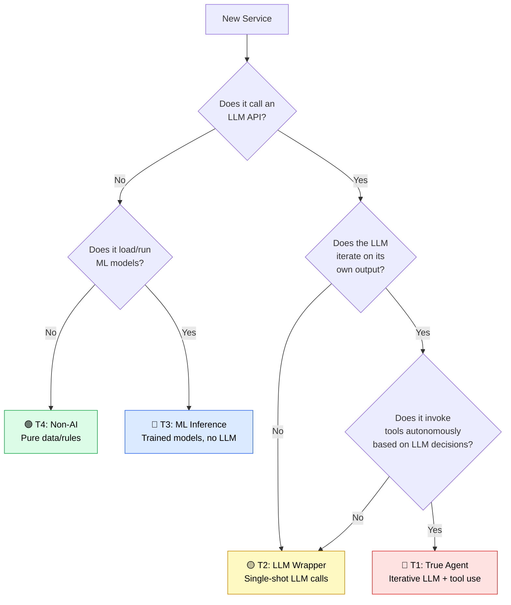

# AI/Agent Service Classification

**Created:** 2026-03-16 | **Updated:** 2026-03-16
**Epic:** 66 — AI/Agent Service Classification & Architecture Documentation
**Status:** Active — Single source of truth for AI tier classification

---

## Purpose

This document classifies all 51+ HomeIQ services into four tiers based on their actual AI/ML capabilities, eliminating confusion caused by misleading service names (e.g., "proactive-agent-service" is not an agent, "ai-pattern-service" uses no LLM).

**Related:** [ADR: Single Agent Architecture](adr-single-agent-architecture.md) | [Service Groups](service-groups.md) | [TECH_STACK.md](../../TECH_STACK.md)

---

## Tier Definitions

| Tier | Label | Definition | Example |
|------|-------|-----------|---------|
| **T1** | **True Agent** | Iterative LLM loop with tool use — the LLM decides what to do next, invokes tools, and iterates on results | ha-ai-agent-service |
| **T2** | **LLM Wrapper** | Single-shot or few-shot LLM calls — sends a prompt, receives a response, no iterative tool use | ai-automation-service-new |
| **T3** | **ML Inference** | Uses trained ML models (sklearn, PyTorch, OpenVINO, sentence-transformers) but no LLM API calls | ai-pattern-service |
| **T4** | **Non-AI** | Pure data/rules — no LLM, no ML models, deterministic logic only | data-api |

---

## Classification Table

### Group 1: core-platform (6 services)

| Service | Port | Tier | LLM/Model | Agent Loop | Key Evidence |
|---------|------|------|-----------|------------|-------------|
| websocket-ingestion | 8001 | **T4** Non-AI | None | No | Pure WebSocket→InfluxDB writer |
| data-api | 8006 | **T4** Non-AI | None | No | CRUD/query service over PostgreSQL |
| admin-api | 8004 | **T4** Non-AI | None | No | System control plane, health checks |
| health-dashboard | 3000 | **T4** Non-AI | None | No | React UI — no server-side AI |
| data-retention | 8080 | **T4** Non-AI | None | No | Scheduled cleanup/compression |
| ha-simulator | 8123 | **T4** Non-AI | None | No | Mock HA instance for testing |

### Group 2: data-collectors (8 services)

| Service | Port | Tier | LLM/Model | Agent Loop | Key Evidence |
|---------|------|------|-----------|------------|-------------|
| weather-api | 8009 | **T4** Non-AI | None | No | Fetches external weather data |
| smart-meter-service | 8014 | **T4** Non-AI | None | No | Fetches smart meter readings |
| sports-api | 8005 | **T4** Non-AI | None | No | Fetches sports schedules |
| air-quality-service | 8012 | **T4** Non-AI | None | No | Fetches air quality data |
| carbon-intensity-service | 8010 | **T4** Non-AI | None | No | Fetches carbon intensity data |
| electricity-pricing-service | 8011 | **T4** Non-AI | None | No | Fetches electricity prices |
| calendar-service | 8013 | **T4** Non-AI | None | No | Calendar integration |
| log-aggregator | 8015 | **T4** Non-AI | None | No | Log collection/forwarding |

### Group 3: ml-engine (10 services)

| Service | Port | Tier | LLM/Model | Agent Loop | Key Evidence |
|---------|------|------|-----------|------------|-------------|
| ai-core-service | 8018 | **T2** LLM Wrapper | OpenAI GPT | No | Single-shot LLM calls for text generation |
| openvino-service | 8019 | **T3** ML Inference | OpenVINO IR models | No | Runs optimized inference models |
| ml-service | 8020 | **T3** ML Inference | sklearn, PyTorch | No | General ML model serving |
| rag-service | 8027 | **T3** ML Inference | sentence-transformers | No | Embedding generation + vector search |
| ai-training-service | 8022 | **T3** ML Inference | PyTorch, transformers | No | Model fine-tuning pipelines |
| device-intelligence-service | 8019 | **T3** ML Inference | sklearn, NER models | No | Device classification, naming |
| model-prep | — | **T3** ML Inference | ONNX, OpenVINO toolkit | No | Model conversion/optimization |
| nlp-fine-tuning | — | **T3** ML Inference | transformers, datasets | No | NLP model fine-tuning |
| ner-service | — | **T3** ML Inference | spaCy, custom NER | No | Named entity recognition |
| openai-service | — | **T2** LLM Wrapper | OpenAI GPT | No | Shared OpenAI API proxy |

### Group 4: automation-core (8 services)

| Service | Port | Tier | LLM/Model | Agent Loop | Key Evidence |
|---------|------|------|-----------|------------|-------------|
| **ha-ai-agent-service** | **8030** | **T1 True Agent** | **OpenAI GPT-5.2-codex** | **Yes** | **Iterative tool-calling loop in chat_endpoints.py — LLM decides which tools to invoke, processes results, iterates until task complete** |
| ai-automation-service-new | 8025 | **T2** LLM Wrapper | OpenAI GPT-5-mini / GPT-5.2-codex | No | Single-shot YAML generation from prompt; no iterative tool use |
| ai-query-service | 8018 | **T2** LLM Wrapper | OpenAI GPT-5-mini | No | NL→SQL query translation, single-shot |
| yaml-validation-service | 8037 | **T4** Non-AI | None | No | Rule-based YAML validation |
| automation-linter | 8020 | **T4** Non-AI | None | No | Rule-based YAML linting |
| ai-code-executor | 8030 | **T4** Non-AI | None | No | Sandboxed code execution (no LLM) |
| automation-trace-service | 8020 | **T4** Non-AI | None | No | Automation execution trace recording |
| ha-device-control | 8046 | **T4** Non-AI | None | No | Direct HA REST API for device control |

### Group 5: blueprints (4 services)

| Service | Port | Tier | LLM/Model | Agent Loop | Key Evidence |
|---------|------|------|-----------|------------|-------------|
| blueprint-index | 8031 | **T4** Non-AI | None | No | Blueprint catalog/search |
| blueprint-suggestion-service | 8032 | **T3** ML Inference | sklearn (recommendation) | No | ML-based blueprint recommendations |
| rule-recommendation-ml | 8035 | **T3** ML Inference | sklearn, FP-Growth | No | Rule mining and recommendation |
| automation-miner | — | **T3** ML Inference | FP-Growth, association rules | No | Pattern mining from automation history |

### Group 6: energy-analytics (3 services)

| Service | Port | Tier | LLM/Model | Agent Loop | Key Evidence |
|---------|------|------|-----------|------------|-------------|
| energy-correlator | 8017 | **T3** ML Inference | sklearn (regression) | No | Energy usage correlation analysis |
| energy-forecasting | 8037 | **T3** ML Inference | LSTM, Prophet | No | Time-series energy forecasting |
| proactive-agent-service | 8031 | **T4** Non-AI | None | No | **Despite the name — scheduled rule-based task runner, no LLM, no agent loop** |

### Group 7: device-management (8 services)

| Service | Port | Tier | LLM/Model | Agent Loop | Key Evidence |
|---------|------|------|-----------|------------|-------------|
| device-health-monitor | — | **T4** Non-AI | None | No | Rule-based device health checks |
| device-context-classifier | — | **T3** ML Inference | sklearn classifiers | No | Device type classification |
| device-setup-assistant | 8021 | **T4** Non-AI | None | No | Guided device setup wizard |
| device-database-client | — | **T4** Non-AI | None | No | Device data access layer |
| device-recommender | — | **T3** ML Inference | sklearn (collaborative filtering) | No | Device purchase recommendations |
| activity-recognition | 8036 | **T3** ML Inference | sklearn, Isolation Forest | No | Activity pattern detection |
| activity-writer | 8035 | **T4** Non-AI | None | No | Activity event persistence |
| ha-setup-service | 8020 | **T4** Non-AI | None | No | HA connection setup/discovery |

### Group 8: pattern-analysis (2 services)

| Service | Port | Tier | LLM/Model | Agent Loop | Key Evidence |
|---------|------|------|-----------|------------|-------------|
| ai-pattern-service | 8020 | **T3** ML Inference | LSTM, Isolation Forest, FP-Growth | No | **Despite "AI" name — uses classical ML detectors, no LLM** |
| api-automation-edge | 8025 | **T4** Non-AI | None | No | Edge API for automation synergies |

### Group 9: frontends (5 services)

| Service | Port | Tier | LLM/Model | Agent Loop | Key Evidence |
|---------|------|------|-----------|------------|-------------|
| ai-automation-ui | 3001 | **T4** Non-AI | None | No | React UI — calls backend APIs |
| observability-dashboard | 8501 | **T4** Non-AI | None | No | Streamlit monitoring dashboard |
| health-dashboard | 3000 | **T4** Non-AI | None | No | (Listed under core-platform) |
| jaeger | 16686 | **T4** Non-AI | None | No | Distributed tracing UI |
| voice-gateway | 8041 | **T2** LLM Wrapper | OpenAI Whisper + GPT | No | Speech-to-text + NL intent, single-shot |

---

## Summary Statistics

| Tier | Count | Percentage | Services |
|------|-------|-----------|----------|
| **T1** True Agent | 1 | 2% | ha-ai-agent-service |
| **T2** LLM Wrapper | 5 | 10% | ai-automation-service-new, ai-query-service, ai-core-service, openai-service, voice-gateway |
| **T3** ML Inference | 14 | 27% | openvino, ml-service, rag-service, ai-training, device-intelligence, model-prep, nlp-fine-tuning, ner-service, blueprint-suggestion, rule-recommendation-ml, automation-miner, energy-correlator, energy-forecasting, ai-pattern-service, device-context-classifier, device-recommender, activity-recognition |
| **T4** Non-AI | 31 | 61% | All remaining services |

**Key insight:** Only **1 out of 51 services** (2%) is a true autonomous agent. 5 services (10%) use LLM APIs. 14 services (27%) use classical ML. The remaining 61% are pure data/rules services.

---

## Misleading Names — Clarification

These services have names containing "AI" or "agent" but are **not** what their names suggest:

| Service | Name Suggests | Actual Tier | Reality |
|---------|--------------|-------------|---------|
| **proactive-agent-service** | Autonomous agent | T4 Non-AI | Scheduled rule-based task runner — no LLM, no agent loop |
| **ai-pattern-service** | LLM-powered | T3 ML Inference | Classical ML detectors (LSTM, Isolation Forest, FP-Growth) |
| **ai-code-executor** | AI coding | T4 Non-AI | Sandboxed Python execution — no AI involved |
| **ai-automation-ui** | AI frontend | T4 Non-AI | React UI that calls backend APIs |
| **device-intelligence-service** | AI intelligence | T3 ML Inference | sklearn classifiers and NER — no LLM |

---

## New Service Classification Decision Tree

Use this flowchart when adding a new service to determine its AI tier:

### Decision Rules

1. **Does it call an LLM API?** (OpenAI, Anthropic, etc.)
   - If no → check for ML models
   - If yes → proceed to iteration check

2. **Does it load/run ML models?** (sklearn, PyTorch, TensorFlow, OpenVINO, spaCy)
   - If no → **T4 Non-AI**
   - If yes → **T3 ML Inference**

3. **Does the LLM iterate on its own output?** (multi-turn, loop until done)
   - If no → **T2 LLM Wrapper** (single prompt → single response)
   - If yes → check for tool use

4. **Does it invoke tools autonomously?** (function calling, tool_calls loop)
   - If no → **T2 LLM Wrapper** (iterates but doesn't take actions)
   - If yes → **T1 True Agent** (full agent loop)

---

## Static Manifest (for Health Dashboard)

The file `domains/core-platform/health-dashboard/public/ai-tier-manifest.json` contains the tier data consumed by the dashboard for badge rendering. Update it when services are added or reclassified.
