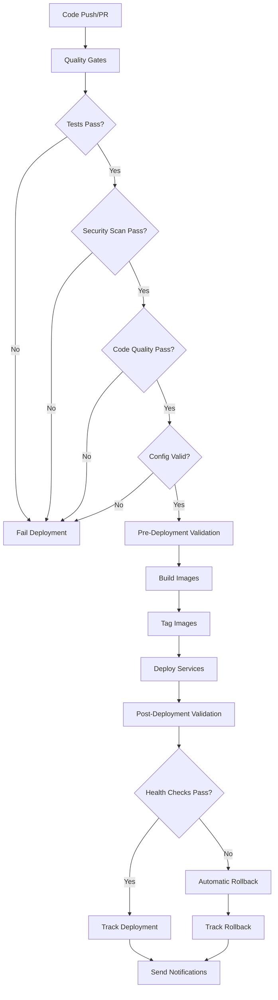

# HomeIQ Deployment Pipeline Documentation

**Last Updated:** February 7, 2026  
**Status:** Active  
**Version:** 2.1

---

## Overview

The HomeIQ deployment pipeline is a comprehensive CI/CD system that automates the build, test, validation, and deployment of 47+ microservices to production. The pipeline implements 2025 best practices including quality gates, automated rollback, deployment tracking, and comprehensive notifications.

## Pipeline Architecture



## Pipeline Components

### 1. Quality Gates Workflow

**File:** `.github/workflows/deploy-production.yml` (quality-gates job)

**Purpose:** Ensure code quality before deployment

**Gates:**
- **Tests:** All unit, integration, and E2E tests must pass
- **Security:** No CRITICAL or HIGH vulnerabilities in security scans
- **Code Quality:** Code quality scores meet thresholds (≥70 overall, ≥80 for critical services)
- **Config Validation:** Docker Compose configuration is valid

**Failure Behavior:** Deployment is blocked if any gate fails

### 2. Pre-Deployment Validation

**File:** `scripts/deployment/validate-deployment.py`

**Purpose:** Validate deployment configuration before deployment

**Checks:**
- Docker Compose configuration validation
- Environment variable verification
- Service dependency validation
- Resource limit verification (NUC constraints)

**Usage:**
```bash
python scripts/deployment/validate-deployment.py --pre-deployment
```

### 3. Deployment Execution

**File:** `.github/workflows/deploy-production.yml` (deploy job)

**Steps:**
1. Generate unique deployment ID
2. Build all Docker images in parallel
3. Tag images with deployment ID for rollback capability
4. Start all services
5. Wait for services to stabilize

**Concurrency:** Only one deployment can run at a time (prevents conflicts)

### 4. Post-Deployment Validation

**File:** `scripts/deployment/validate-deployment.py`

**Purpose:** Verify deployment success

**Checks:**
- Service connectivity verification
- Database connectivity (InfluxDB, SQLite)
- Inter-service communication tests

**Usage:**
```bash
python scripts/deployment/validate-deployment.py --post-deployment
```

### 5. Health Check Verification

**File:** `scripts/deployment/health-check.sh`

**Purpose:** Comprehensive health checks for all 30+ services

**Features:**
- Health endpoint verification for all services
- Container status checks
- Database health verification
- Response time monitoring
- JSON output for automation

**Usage:**
```bash
# Full health check
bash scripts/deployment/health-check.sh

# Critical services only
bash scripts/deployment/health-check.sh --critical-only

# JSON output
bash scripts/deployment/health-check.sh --json
```

**Critical Services:**
- `influxdb` - Time-series database
- `websocket-ingestion` - Event ingestion
- `data-api` - Data query API
- `admin-api` - Admin API
- `health-dashboard` - Health dashboard UI

### 6. Automated Rollback

**File:** `scripts/deployment/rollback.sh`

**Purpose:** Automatically rollback failed deployments

**Features:**
- Automatic rollback on health check failures
- Rollback to previous successful deployment
- Rollback verification
- Rollback tracking

**Usage:**
```bash
# Rollback to previous deployment
bash scripts/deployment/rollback.sh --previous

# Rollback to specific deployment ID
bash scripts/deployment/rollback.sh --deployment-id <id>

# Rollback to specific tag
bash scripts/deployment/rollback.sh --tag <tag>
```

### 7. Deployment Tracking

**File:** `scripts/deployment/track-deployment.py`

**Purpose:** Track deployment history and metrics

**Features:**
- Deployment history database (SQLite)
- Deployment metrics:
  - Total deployments
  - Success/failure rates
  - Mean time to recovery (MTTR)
  - Deployment duration
  - Rollback frequency
- Audit logging

**Usage:**
```bash
# Track a deployment
python scripts/deployment/track-deployment.py \
  --deployment-id <id> \
  --status success \
  --commit <sha> \
  --branch <branch>

# List recent deployments
python scripts/deployment/track-deployment.py --list

# Show metrics
python scripts/deployment/track-deployment.py --metrics
```

### 8. Deployment Notifications

**File:** `.github/workflows/deployment-notify.yml`

**Purpose:** Notify team of deployment status

**Channels:**
- **Slack:** Webhook integration for deployment events
- **Email:** Email notifications for critical deployments (failures)
- **Webhook:** Custom webhook integration
- **GitHub:** Deployment status in workflow summary

**Configuration:**
- `SLACK_WEBHOOK_URL` - Slack webhook URL (optional)
- `DEPLOYMENT_WEBHOOK_URL` - Custom webhook URL (optional)
- `EMAIL_SMTP_*` - Email configuration (optional)

## Quality Gates

### Test Gate

**Requirement:** All tests must pass

**Commands:**
```bash
# Unit tests
python scripts/simple-unit-tests.py

# Integration tests
pytest tests/integration/ -v

# E2E tests
npx playwright test
```

**Failure:** Deployment blocked

### Security Gate

**Requirement:** No CRITICAL or HIGH vulnerabilities

**Tool:** Trivy vulnerability scanner

**Commands:**
```bash
# Security scan
trivy image <image-name> --severity CRITICAL,HIGH
```

**Failure:** Deployment blocked

### Code Quality Gate

**Requirement:** 
- Overall quality score ≥ 70
- Critical services ≥ 80

**Tool:** TappsCodingAgents reviewer

**Commands:**
```bash
# Code quality check
python -m tapps_agents.cli reviewer score <file>
```

**Failure:** Deployment blocked

### Config Validation Gate

**Requirement:** Docker Compose configuration is valid

**Commands:**
```bash
# Validate config
docker compose config --quiet
```

**Failure:** Deployment blocked

## Deployment Environments

### Production Environment

**Configuration:**
- Environment name: `production`
- Protection: Required reviewers (if configured)
- Concurrency: One deployment at a time
- URL: `https://homeiq.example.com`

**Trigger:**
- Push to `main` branch
- Tag push (`v*`)
- Manual workflow dispatch

### Test Environment

**Configuration:**
- Environment name: `test`
- Protection: None (for CI/CD testing)
- Concurrency: Multiple allowed

**Trigger:**
- Pull requests
- Manual workflow dispatch

## Deployment Process

### Automated Deployment (Recommended)

1. **Push to main branch** or **create tag**
2. **Quality gates run automatically**
3. **If gates pass, deployment starts**
4. **Services are built and deployed**
5. **Health checks verify deployment**
6. **Notifications sent**

### Manual Deployment

1. **Go to GitHub Actions**
2. **Select "Deploy to Production" workflow**
3. **Click "Run workflow"**
4. **Select branch and options**
5. **Click "Run workflow"**

**Options:**
- `skip_tests` - Skip test gate (use with caution)
- `skip_security` - Skip security gate (use with caution)

## Rollback Process

### Automatic Rollback

**Trigger:** Health check failures after deployment

**Process:**
1. Health checks fail
2. Rollback script automatically executes
3. Previous deployment images are restored
4. Services restarted with previous configuration
5. Rollback verified
6. Rollback tracked and notified

### Manual Rollback

**Process:**
1. Identify failed deployment ID
2. Run rollback script:
   ```bash
   bash scripts/deployment/rollback.sh --deployment-id <id>
   ```
3. Verify rollback success
4. Check deployment tracking

## Deployment Metrics

### Available Metrics

- **Total Deployments:** Total number of deployments
- **Success Rate:** Percentage of successful deployments
- **Average Duration:** Average deployment time
- **Rollback Rate:** Percentage of deployments that required rollback
- **MTTR:** Mean time to recovery (for failed deployments)
- **Recent Deployments:** Deployments in last 7 days

### Viewing Metrics

```bash
# Show deployment metrics
python scripts/deployment/track-deployment.py --metrics

# List recent deployments
python scripts/deployment/track-deployment.py --list
```

## Monitoring and Observability

### Health Monitoring

**Script:** `scripts/deployment/health-check.sh`

**Frequency:** 
- Post-deployment (automatic)
- Every 5 minutes (recommended cron job)

**Output:**
- JSON format for automation
- Text format for human review

### Deployment Tracking

**Database:** `data/deployments.db` (SQLite)

**Tables:**
- `deployments` - Deployment history
- `deployment_metrics` - Deployment metrics

### Logs

**Location:** Service logs in Docker containers

**Viewing:**
```bash
# View all service logs
docker compose logs

# View specific service
docker compose logs <service-name>

# Follow logs
docker compose logs -f <service-name>
```

## Troubleshooting

### Deployment Fails at Quality Gates

**Check:**
1. Review test failures
2. Review security scan results
3. Review code quality scores
4. Fix issues and retry

### Deployment Fails at Health Checks

**Check:**
1. Review health check output
2. Check service logs
3. Verify service dependencies
4. Check database connectivity
5. Automatic rollback should trigger

### Rollback Fails

**Check:**
1. Verify previous deployment images exist
2. Check Docker daemon status
3. Verify disk space
4. Manual intervention may be required

### Notifications Not Working

**Check:**
1. Verify secrets are configured in GitHub
2. Check webhook URLs are correct
3. Review workflow logs for errors
4. Notifications are non-blocking (won't fail deployment)

## Best Practices

### Pre-Deployment

1. **Test locally** before pushing
2. **Review changes** in pull request
3. **Run quality checks** locally
4. **Verify environment variables** are set

### During Deployment

1. **Monitor workflow** in GitHub Actions
2. **Watch for notifications** (Slack, email)
3. **Be ready to rollback** if needed

### Post-Deployment

1. **Verify health checks** pass
2. **Monitor service logs** for errors
3. **Check deployment metrics**
4. **Verify functionality** in production

## Configuration

### Required Secrets

**GitHub Repository Secrets:**
- `HOME_ASSISTANT_TOKEN` - Home Assistant API token
- `INFLUXDB_TOKEN` - InfluxDB authentication token
- `INFLUXDB_PASSWORD` - InfluxDB admin password

### Optional Secrets

- `SLACK_WEBHOOK_URL` - Slack notifications
- `DEPLOYMENT_WEBHOOK_URL` - Custom webhook
- `EMAIL_SMTP_*` - Email notifications

### Environment Variables

See `infrastructure/env.example` for all environment variables.

## References

- [Deployment Runbook](./DEPLOYMENT_RUNBOOK.md) - Step-by-step deployment procedures
- [Architecture Documentation](../architecture/event-flow-architecture.md) - Event flow and architecture
- [Documentation Index](../README.md) - All docs and correct paths

---

**Maintainer:** DevOps Team  
**Review Frequency:** Quarterly  
**Last Review:** December 27, 2025

