# HomeIQ backlog — implementation plan (2026-08-17)

> Reviewed via `linear-read` (team TappsCodingAgents / project HomeIQ), every open
> issue body fetched with `get_issue`, plus repo, CI, container and AgentForge state
> checked live. Companion to `prompts/homeiq-backlog-drain.md` (the run loop) —
> this document is the *what/why/in-what-order*; the drain prompt stays the *how*.

## 1. Snapshot

| Signal | Value (verified 2026-08-17) |
|---|---|
| Open issues | **47** (6 epics + 41 stories/defects). 3 "In Progress" (TAP-5283/5300/5302) — bulk status flip on 2026-08-11 tied to PR #80; **no acceptance box checked, no branches, no comments recording work.** |
| Estimated open points | ≈ **199 pts** on estimated stories (+7 unestimated: 6071, 6066, 5430, 5977 chain) |
| Branch | `feat/tap-5431-local-calendar` — 25 ahead / **3 behind** master (bug-hunt PRs #84–86 merged 08-18). PR #83 draft, owner-gated. |
| CI | Red on **master too** — ruff lint across ~20 domain services, test failures on ml-engine services, TAPPS gate (known upstream). Shared-libs CI green. Not caused by the branch. |
| Test baselines | `libs/homeiq-ha` **246 passed** · `ha-setup-service` **60 passed** (run separately) |
| Wave 8 state | Only `docs/mcp/homeiq-mcp-tool-catalogue.md` + `homeiq-mcp-tools.schema.json` (v1.1.1, normative) exist. No server code, no `mcp` SDK in `.venv`, no compose entry. |
| AgentForge | Up — 4.59.1 on `:8010` (api) / `:8001` (all). `agentforge/projects/homeiq/` already holds 6 agents + 3 workflows (genome seed). |
| Containers | 94 running, 59 `homeiq-*`, 79 healthy. Every Wave 11 retire-candidate still running. `energy-correlator` has logged nothing but health/metrics in 72 h. |

## 2. Open work by epic

| Epic | Pri | Stories (points) | Σ pts | Gate |
|---|---|---|---|---|
| TAP-5282 MCP server | Urgent | 5293(5) 5294(8) 5295(8) 5296(3) 5297(5) + 6071(—) | 29 | 6071 blocks 5294 `detect_anomalies` |
| TAP-5285 Genome | High | 5311(5) 5312(8) 5313(5) 5314(8) 5315(8) 5316(8) 5317(8) 5318(5) | 55 | needs 5282 first |
| TAP-5286 Safety/cost | High | 5319(5) 5320(8) 5321(5) 5322(5) 5323(3) 5325(5) | 31 | 5313 before 5320; 5322 dup of 5298 |
| TAP-5284 HA integration | High | 5305(5) 5306(8) 5307(8) 5308(8) 5309(5) 5310(5) | 39 | 5308 needs 5293–5295; 5310 needs 5283 |
| TAP-5283 Data-plane collapse | High (started) | 5298(5) 5299(8) 5300(5) 5301(8) 5302(8) 5303(3) 5304(3) 5910(5) | 45 | destructive; 5302 needs re-scope; 5304 needs 5284 |
| TAP-5977 Office presence | High | 6018(—) 5979(—) 5978(—) 5980(—) | — | 6018 is **code + file drop**, not physical |
| Standalone | — | 5430(—, 1/4 boxes done) · 6066(—) | — | 5430 needs write path to `/config` |

## 3. Findings that change the sequencing

1. **TAP-5302 is contradicted by its own comment (Bill, 2026-08-11).** Only `ai-query-service` is retirable (already in TAP-5910). `ai-automation-service-new`, `ha-ai-agent-service`, `proactive-agent-service` are live and load-bearing. → Re-scope before any execution: close 5302 in favour of 5910 + one new story "cut `ai-automation-service-new` LLM path over to AF genes".
2. **TAP-5298 ≡ TAP-5322 for the credential move**, and neither can be satisfied by deleting `openai-service` alone: `ai-automation-service-new` holds a real `OPENAI_API_KEY`. → Owner of the credential move = **TAP-5322** (governance story); TAP-5298 narrows to container deletion + caller redirect (which TAP-5910 already covers). 5322 cannot close until the 5302-replacement story lands (Wave 9b, not Wave 11).
3. **TAP-5300 / 5283 "In Progress" is not real progress** — the attached PR #80 is a prompt change. TAP-5910 already proves ai-core-service has zero functional callers. → Fold 5300 into 5910; flip 5300 back to Backlog or close-as-duplicate; leave 5283 In Progress only if 5910 is actually being executed.
4. **TAP-5910 conflicts with the Wave 8 catalogue.** 5910 lists `energy-correlator` dead (zero correlations written); catalogue tools 14 `get_energy_correlations` / 15 `get_device_energy_impact` wrap its output. Live check agrees it's idle. → Decide at TAP-5295: either revive the correlator (it's the only power-delta source) or ship v1 without tools 14/15 and record the catalogue change (v1.2.0). Recommended: **drop 14/15 from v1**, keep the schema entries marked `deferred`, revisit when TAP-5301 model server exists.
5. **TAP-6018 is agent-workable.** Diagnosis is complete: presence is on manufacturer cluster `0xfcc0`, no built-in quirk, HA current. The work is (a) author a zigpy custom quirk for `lumi.sensor_occupy.agl8`, (b) drop it into `custom_zha_quirks/` on 192.168.1.80, (c) reload ZHA. Only the *re-interview wake* (5979) and *physical placement* (5978) are human. (b) shares its blocker with TAP-5430: **no provisioned write path to `/config`** (core_ssh authorized_keys empty per last handoff).
6. **One owner action unblocks two tickets.** Provisioning a dedicated agent SSH credential in `core_ssh` unblocks TAP-5430 (recorder/http recipes) *and* TAP-6018 (quirk file drop) → whole TAP-5977 chain.
7. **CI is red on master and no ticket owns it.** TAP-5281 (CI restoration) is closed, but the restored per-service jobs fail on ruff across ~20 services plus tests on ml-engine services. TAP-5297/5303/5311/5318 all say "depends on CI being restored". → File one story: "domain CI: ruff/test debt making restored path-filtered jobs red" — scope = make the jobs *meaningful* (fix or explicitly baseline), not green-wash. Note many of the failing services are on the TAP-5910 delete list; delete first, then fix what remains.
8. **Master moved under the branch.** 3 bug-hunt PRs merged after PR #83 was opened. Rebase before any new commit lands on this branch; the branch note in the handoff ("new work continues HERE") now costs more than it saves.

## 4. Owner decisions (batched — answer once, unblocks the plan)

| # | Decision | Recommended | Unblocks |
|---|---|---|---|
| A | Provide agent write path to HA `/config` | Provision a dedicated agent SSH key in `core_ssh` authorized_keys (alt: hand-edit two YAML blocks + drop one quirk file, re-scope recipes to check-only) | TAP-5430, TAP-6018 → 5979/5978/5980 |
| B | Merge PR #83 (5431 + defect batch) | Merge after rebase onto master; libs CI green, gates pass; per-service CI red is pre-existing | Phase 0, all later branches |
| C | Credential rotation for values exposed in git history (6036/5993) | Rotate now; independent of the AF-vault move | TAP-5322 partial |
| D | Accept TAP-5910 moving ahead of Wave 10 (see §5, Phase 5) | Yes — evidence-backed, and 5310 packaging depends on the collapse | Wave 11 ordering |
| E | Catalogue tools 14/15 with dead correlator | Drop from v1 (mark deferred) | TAP-5295 |

## 5. Phased plan

Each phase ends with the drain prompt's verifier panel (3 perspective-diverse opus refuters) and a `SCORE` line; story closes carry pasted evidence on the ticket. Points are Linear estimates; sessions assume the observed ~10–15 pts/session.

### Phase 0 — Housekeeping (≈1 session, no story points)
- Rebase `feat/tap-5431-local-calendar` onto master (3 commits), push, request PR #83 merge (Decision B). New work branches from master afterwards.
- Linear triage via `linear-issue`: 5302 → re-scope per Finding 1 (close as dup of 5910 + file the cutover story); 5300 → fold into 5910; 5298 → narrow (Finding 2), note owner on 5322; 6018 → note agent-workable split; file the CI-debt story (Finding 7); record Decision E on 5295 + catalogue.
- Refresh `prompts/homeiq-backlog-drain.md` §"live backlog" table and Sub-goal 4/8 text with the above so the loop and Linear agree.
- Exit: `git status` clean, PR #83 merged or explicitly owner-held, every re-scope written on its ticket.

### Phase 1 — Wave 8: MCP server (epic TAP-5282; 29 pts + 6071; ≈3 sessions)
Order: **6071 → 5293 → 5294 → 5295 → 5296 → 5297**.
- **TAP-6071** (High): move `GET /api/devices/{device_id}` below the five static routes in `devices_endpoints.py`, delete `_build_unshadowed_app`, one regression test per path against the prod app. Small, unblocks `detect_anomalies`.
- **TAP-5293** (5): `mcp` SDK (`tapps_lookup_docs` first — not in `.venv` yet), `streamable_http_app()` at `/mcp` + stdio, `/health` with dependency status, bearer token with read vs mutate scope, fail-fast config, compose service on the internal network with stable hostname. Implementation notes already in the catalogue md (dict→string state projection, truncate+flag budgets).
- **TAP-5294** (8): tools 1–10 (history/events/devices/entities/areas/state/automation stats) + `detect_anomalies` over data-api. Read-only, schema-conformant, size-budgeted; data-api HTTP untouched.
- **TAP-5295** (8): tools 11–13, 16 (patterns, synergies, energy summary, device health); tools 14/15 per Decision E. Metric definitions must match the energy-truth skill (TAP-5316) — write the definitions in the tool docstrings now, lift them into the skill later.
- **TAP-5296** (3): overlay registry entry (operator path, no AF rebuild), test gene via `install-from-yaml`, live e2e call.
- **TAP-5297** (5): per-tool contract tests pinned to `homeiq-mcp-tools.schema.json` + gene→tool dependency map, wired into `reusable-group-ci.yml`.
- Exit (Done-when 4): `/health` 200; pasted tool call with real data for ≥1 query + ≥1 analytics tool; contract tests green; `homeiq` in the AF overlay registry.

### Phase 2 — Human-gated track (runs in parallel once Decision A lands)
- **TAP-6018**: author quirk (agent) → file drop via provisioned path → ZHA reload → both units expose `binary_sensor.*occupancy`. Commit the drop mechanism.
- **TAP-5430**: recorder + http recipes through the same write path; `check` SATISFIED without writes; second `apply` zero changes.
- Then human steps: **5979** (wake + re-interview `c0:f4`) → **5978** (place sensor, VAL-017 smoke) → **5980** (agent: demote proxies in manifest).
- Until Decision A: re-check `get_issue(TAP-6018)` once per run, record, skip (drain standing rule).

### Phase 3 — Wave 9a: Genome (epic TAP-5285; 55 pts; ≈5 sessions)
Order: **5311 → 5312 → 5313 → 5316 (+5319 skill content) → 5314 → 5315 → 5317 → 5318**.
- 5311 fork + drift check needs the shared genome source (outside this repo — locate first, hard-stop if absent).
- 5313 injection judge before any chromosome that ingests HA text; 5316's safety-rules skill and 5319's hard-deny list are one artifact — author once under 5319, reference from 5316.
- 5315 analysis genes declare the `homeiq` MCP server (Phase 1 output) with least-privilege tool lists.
- 5318 publish pipeline (`install-from-yaml` only, round-trip assertions, offline kit validation, pinned AF version) is the evidence generator for the whole wave — consider pulling it *earlier* (right after 5311) so every gene lands through the pipeline rather than being back-validated.
- Exit (Done-when 5, first half): every gene/chromosome passes offline kit validation, pasted.

### Phase 4 — Wave 9b: Safety gate + cost (epic TAP-5286; 31 pts; ≈3 sessions)
Order: **5320 → 5321 → 5323 → 5325 → 5322 (+ the 5302-replacement cutover story)**.
- 5320 wires 5313/5314/5319 into the automation-proposal chromosome; ambiguous → human decision, never default-deploy; audit every gate decision.
- 5321 provisional caps first, tighten after baseline spend exists; 5323 is AF config + verification.
- 5322 credential move can only close after `ai-automation-service-new`'s LLM path is on AF genes (new story from Phase 0). Rotation per Decision C.
- Exit (Done-when 5, second half): pasted deny-list refusal + pasted budget-gate hold.

### Phase 5 — Wave 11a: evidence-backed deletions (TAP-5910 → 5303; ≈2 sessions) — proposed to run **before** Wave 10 (Decision D)
- TAP-5910's 15 services: per-service evidence already on the ticket; each deletion is an Autonomy hard-stop and needs a pasted "capability still reachable" call (or an explicit "no capability" finding). Includes the `voice-gateway` repair-or-retire decision.
- Absorbs 5300 (ai-core-service) and 5298's deletion half (openai-service; credential half stays in 5322).
- TAP-5303 regression gate immediately after (count ≤ target, memory ≤ 4 GB, names offenders).
- Exit: container count −15, cold `docker compose up` clean, `scripts/verify-dashboard-contract.sh` no new uncovered paths, health-registry dicts updated.

### Phase 6 — Wave 10: HA integration (epic TAP-5284; 39 pts; ≈4 sessions)
Order: **5305 → 5306 → 5307 → 5308 → 5309 → 5310**, then **5304**.
- 5308 generates HA tools from the *same* MCP catalogue (no second authoring) → depends on Phase 1.
- Installing on live HA is an apply — gateway path or hard-stop (drain rule).
- 5310 packaging waits for Phase 5's collapse; 5304 (retire ai-automation-ui) is the last story of the wave.
- Exit (Done-when 6): `/api/config/config_entries` shows the HomeIQ entry `loaded`.

### Phase 7 — Wave 11b: consolidations (5299, 5301, narrowed 5302 remainder; 24 pts; ≈2–3 sessions)
- 5299 collectors → one adapter process (6 adapters after 5910 drops carbon-intensity + log-aggregator; calendar collector already changed under 5431 — read it first).
- 5301 ML → single model server (list narrowed by 5910; expose via MCP → catalogue v1.x bump, and the point at which tools 14/15 can return).
- Exit (Done-when 7): `homeiq` healthy containers ≤15 and ≥8, every retirement capability-proven.

### Anytime / small
- **TAP-6066** libs undeclared-imports audit (Medium) — one session, wire into `libs-ci.yml`; false-positive rules in the ticket.
- **CI-debt story** (Finding 7) — after Phase 5 shrinks the service list.

## 6. Dependency graph

```mermaid
flowchart LR
  P0[Phase 0 housekeeping] --> W8
  subgraph W8[Wave 8 · MCP server]
    direction LR
    A6071[6071] --> A5293[5293] --> A5294[5294] --> A5295[5295] --> A5296[5296] --> A5297[5297]
  end
  W8 --> W9a
  subgraph W9a[Wave 9a · genome]
    direction LR
    B5311[5311] --> B5318[5318 pipeline] --> B5312[5312] --> B5313[5313] --> B5319[5319/5316] --> B5314[5314] --> B5315[5315] --> B5317[5317]
  end
  W9a --> W9b
  subgraph W9b[Wave 9b · safety+cost]
    direction LR
    C5320[5320] --> C5321[5321] --> C5323[5323] --> C5325[5325]
    CUT[cutover story ai-automation-service-new] --> C5322[5322]
  end
  W8 --> W11a
  subgraph W11a[Wave 11a · deletions]
    direction LR
    D5910[5910 +5300 +5298 del] --> D5303[5303]
  end
  W9b --> W10
  W11a --> W10
  subgraph W10[Wave 10 · HA integration]
    direction LR
    E5305[5305] --> E5306[5306] --> E5307[5307] --> E5308[5308] --> E5309[5309] --> E5310[5310] --> E5304[5304]
  end
  W11a --> W11b
  subgraph W11b[Wave 11b · consolidation]
    direction LR
    F5299[5299] --> F5301[5301]
  end
  DA{{Owner: SSH write path}} --> H6018[6018 quirk] --> H5430[5430] 
  H6018 --> H5979[5979 human] --> H5978[5978 human] --> H5980[5980]
```

## 7. Effort and cadence

| Phase | Points | Sessions (10–15 pts) |
|---|---|---|
| 0 Housekeeping | — | 1 |
| 1 Wave 8 | 29 (+6071) | 3 |
| 2 Human-gated | — | 1 agent + owner time |
| 3 Wave 9a | 55 | 4–5 |
| 4 Wave 9b | 31 | 2–3 |
| 5 Wave 11a | 8 (+15 deletions w/ hard-stops) | 2 |
| 6 Wave 10 | 39 (+3) | 3–4 |
| 7 Wave 11b | 24 | 2–3 |
| **Total** | **≈199** | **≈18–22 sessions** |

Cadence per session (unchanged from the drain prompt): Sub-goal 0 preconditions → work stories in order → verifier panel at each wave boundary → `tapps_validate_changed` + `tapps_checklist` → handoff. Caps: 45 iterations / 1.5M output tokens per run.

## 8. Risks and unverified assumptions

- **Shared genome source location** (5311) — lives outside this repo; if not reachable, Wave 9a hard-stops at its first story.
- **AF `install-from-yaml` round-trip** — epic notes say the plain agents endpoint drops MCP list/risk/guardrails; treat 5318 as the gate for every gene, not an afterthought.
- **energy-correlator dead vs catalogue** — Decision E; if the owner wants tools 14/15 in v1, add "revive correlator" to Phase 1 (+3–5 pts).
- **PR #83 mergeability** = `UNKNOWN` until rebased; per-service CI is red on master so a green-check merge policy would block indefinitely — the merge decision has to be evidence-based (libs CI, quality gate, verifier tickets).
- **Deletion orphaning** — deleting ai-core-service (5910) orphans four ML services that "appear used" only through it; 5301 must re-home them, so 5910's evidence table needs a per-service "re-homed in / dropped" column.
- **Physical steps** (5979/5978) stay human-gated regardless of Decision A.

## 9. Immediate next actions (this week)

1. Owner: Decisions A–E (§4). A and B are the ones that move the most work.
2. Agent: Phase 0 in full (rebase, PR #83, Linear triage of 5302/5300/5298/5322/6018, file CI-debt story, sync the drain prompt).
3. Agent: start Phase 1 at TAP-6071 (small, unblocking), then TAP-5293 with `tapps_lookup_docs(mcp)` before code.
