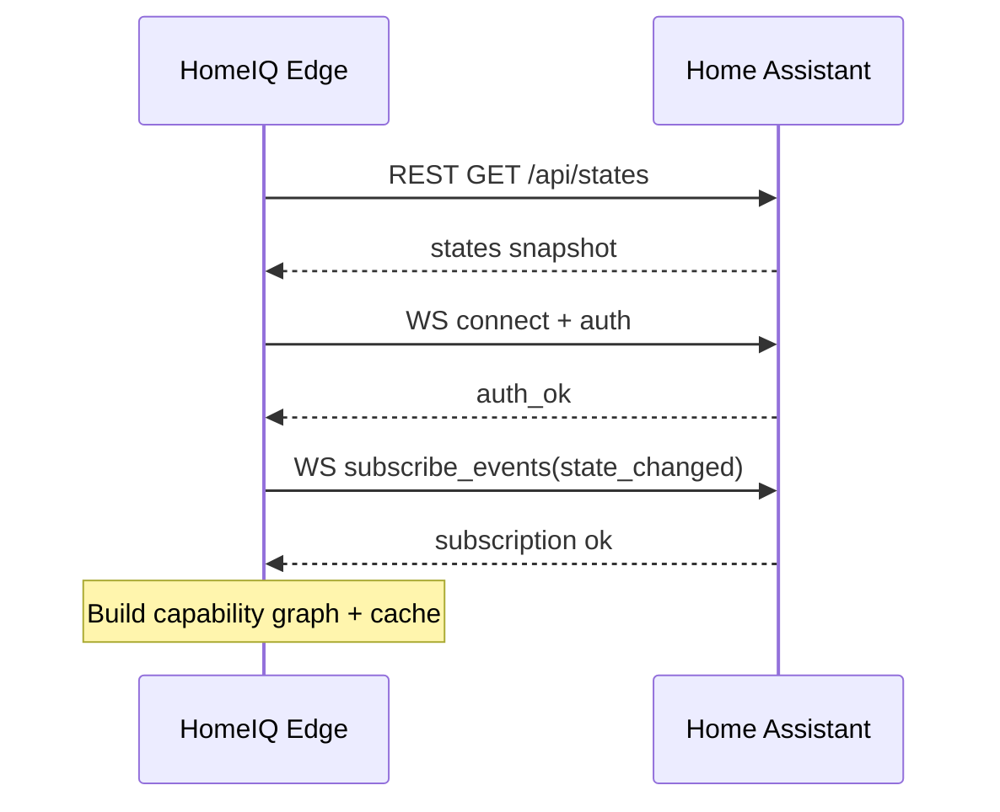
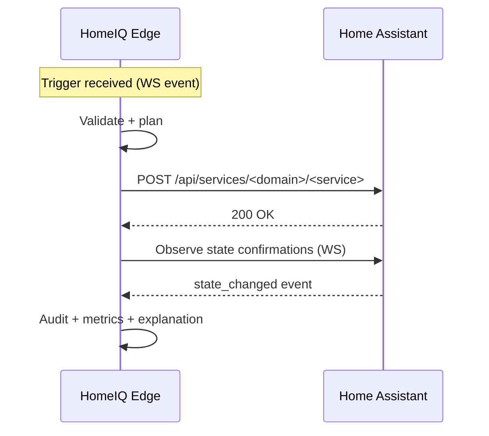

# HomeIQ: Architecture + Interfaces for API-Driven Automations

**Status:** Draft v1  
**Last updated:** 2026-01-15  
**Scope:** Concrete interface contracts, runtime behavior, and production patterns for HomeIQ ↔ Home Assistant

---

## 1. System diagram

```mermaid
flowchart LR
  subgraph HA[Home Assistant]
    WS[/WebSocket API\n/api/websocket/]
    REST[/REST API\n/api/*/]
    DEV[Devices & Integrations]
    EVT[(Event Bus)]
    ST[(State Machine)]
    DEV --> ST
    DEV --> EVT
    WS <---> EVT
    WS <---> ST
    REST <--> ST
  end

  subgraph EDGE[HomeIQ Edge Agent]
    CG[Capability Graph Builder]
    VC[Validator + Planner]
    EX[Executor]
    OB[Observability + Explainability]
    CACHE[(State Cache)]
    WSCL[WS Client]
    RESTCL[REST Client]
    WSCL --> CG
    WSCL --> CACHE
    CG --> VC
    VC --> EX
    EX --> OB
    CACHE --> VC
    WSCL <--> WS
    RESTCL <--> REST
    EX --> RESTCL
    WSCL --> OB
  end

  subgraph CP[HomeIQ Control Plane]
    REG[Spec Registry (versioned)]
    POL[Policy Engine]
    RO[Rollout Manager]
    AUD[Audit Log]
    REG --> RO
    POL --> VC
    RO --> EDGE
    EDGE --> AUD
  end
```

---

## 2. Key design principle: strict hybrid boundary

### Allowed in HA (static plumbing only)
- Provide devices/entities/integrations
- Provide authenticated API access (token)
- Optional: limited webhook-trigger automations (stable entry points)

### All logic lives in HomeIQ
- intent → validation → execution plan → service calls
- policy gating, safety rails, rollouts, audit, observability

---

## 3. Home Assistant API usage (contracts)

### 3.1 Authentication (REST + WS)
HomeIQ uses a dedicated HA user and a long-lived access token (User profile → Security → Long-Lived Access Tokens).

**REST header**
- `Authorization: Bearer <TOKEN>`

**WebSocket auth flow**
- Connect: `ws(s)://<HA_HOST>/api/websocket`
- Server: `{ "type": "auth_required", ... }`
- Client: `{ "type": "auth", "access_token": "<TOKEN>" }`
- Server: `{ "type": "auth_ok", ... }`

Reference: HA WebSocket API docs.

---

## 4. Capability Graph Builder

### 4.1 Inputs
- REST: initial state snapshot and service metadata
- WS: live events to keep state fresh

### 4.2 Outputs
A normalized graph:
- **Entities**: domain, device class, supported features, availability, relationships
- **Devices**: identifiers, manufacturer, model
- **Areas**: mapping to entities/devices
- **Services**: available service calls + schemas/fields

### 4.3 Refresh strategy
- On boot: full snapshot
- On run: incremental updates via WS `state_changed`
- On schedule: reconcile (detect drift / removed entities)

---

## 5. Validation + Planning

### 5.1 Validation stages
1. Spec schema validation
2. Target resolution (capabilities → entities)
3. Service availability + field validation
4. Feature compatibility (supported features)
5. Policy gating (risk level, quiet hours, confirmations)
6. Dry-run plan output
7. Optional live preflight (availability/online)

### 5.2 Planning output
Deterministic list of actions, each with:
- action id, correlation id
- domain/service
- resolved targets
- data payload
- confirmation strategy (optional)
- retry policy class

---

## 6. Execution engine

### 6.1 Idempotency
- Every action has an `idempotency_key`
- Edge maintains a TTL store of executed keys
- On retries/reconnects: suppress duplicates

### 6.2 Retry + backoff + circuit breaker
- transient errors: retry with exponential backoff
- permanent errors: fail fast and mark automation invalid
- circuit breaker per HA instance (open → half-open → closed)

### 6.3 Confirmation strategy (optional)
- After service call, wait for expected state change via WS
- Timeout behavior depends on risk class

---

## 7. Interfaces (REST endpoints)

Endpoint shapes are documented in HA REST API Developer Docs.

### 7.1 Snapshot states
- `GET /api/states`

### 7.2 Single entity state (preflight)
- `GET /api/states/<entity_id>`

### 7.3 Service calls (execution)
- `POST /api/services/<domain>/<service>`

---

## 8. Interfaces (WebSocket messages)

Shapes per HA WebSocket API Developer Docs.

### 8.1 Subscribe to events
Send:
```json
{ "id": 1, "type": "subscribe_events", "event_type": "state_changed" }
```

Receive:
```json
{ "type": "event", "id": 1, "event": { "...": "..." } }
```

---

## 9. Optional webhooks (carefully scoped)

### 9.1 When to use
- A small number of stable inbound triggers when auth is not feasible

### 9.2 Security rules
- Webhook IDs are secrets; never log them.
- Avoid high-risk actions unless you add signed payload + nonce + replay protection + rate limiting.

---

## 10. Production patterns (2025+)

### 10.1 Deployment topologies
- Local-first (recommended): Edge runs on LAN, no inbound exposure.
- Hybrid: Control plane manages specs; edge executes locally.

### 10.2 Resilience
- WS reconnect with jittered backoff
- Cache persistence across restarts
- “safe mode”: pause non-safety automations when HA unstable

### 10.3 Multi-home scaling
- per-home isolated workers/queues
- per-home rate limits (avoid overloading HA)
- canary rollout cohorts

---

## 11. Sequence diagrams

### 11.1 Boot + capability sync


### 11.2 Execute an automation


---

## 12. References (official docs)
- REST API: https://developers.home-assistant.io/docs/api/rest/
- WebSocket API: https://developers.home-assistant.io/docs/api/websocket/
- Webhook trigger + security notes: https://www.home-assistant.io/docs/automation/trigger/
- Authentication: https://www.home-assistant.io/docs/authentication/
- Auth API (long-lived tokens): https://developers.home-assistant.io/docs/auth_api/
- home-assistant-js-websocket (optional client): https://www.npmjs.com/package/home-assistant-js-websocket
