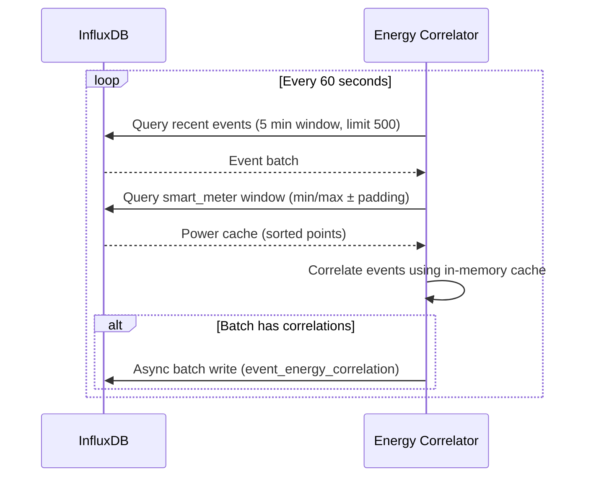

# Energy-Event Correlation Service

**Post-processes HA events and power data to identify causality relationships**

**Port:** 8017
**Technology:** Python 3.11+, aiohttp, InfluxDB
**Container:** homeiq-energy-correlator
**Database:** InfluxDB (home_assistant_events bucket)
**Scale:** Optimized for ~50-100 devices (single-home)

## Overview

The Energy-Event Correlation Service analyzes Home Assistant events and power consumption data to identify which device state changes cause measurable power changes. This creates actionable insights for energy optimization and device power profiling.

### Key Features

- **Temporal Correlation** - Matches events with power changes within configurable time window (±10 seconds default)
- **Batch Processing** - Limits each cycle to newest N events (default 500) to prevent memory issues
- **Smart Power Cache** - In-memory cache for smart_meter data with single window query
- **Async Batch Writes** - Flushes correlations to InfluxDB in batches using async API
- **Retry Queue** - Re-attempts correlations when power data arrives late (configurable size and retention)
- **Multi-Domain Support** - Analyzes switches, lights, climate, fans, covers
- **Threshold Filtering** - Only correlates significant changes (>10W by default)
- **Statistics Tracking** - Monitors correlation/write rates and error counts
- **API Endpoints** - Health check, statistics, and manual triggers

## API Endpoints

### Health Endpoint

```bash
GET /health
```
Health check endpoint with service status.

**Response:**
```json
{
  "status": "healthy",
  "service": "energy-correlator",
  "uptime_seconds": 3600.5,
  "last_successful_fetch": "2025-12-09T10:30:00Z",
  "total_fetches": 60,
  "failed_fetches": 0,
  "success_rate": 1.0
}
```

### Statistics Endpoint

```bash
GET /statistics
```
Get correlation statistics.

**Response:**
```json
{
  "total_events_processed": 1250,
  "correlations_found": 45,
  "correlations_written": 45,
  "correlation_rate_pct": 3.6,
  "write_success_rate_pct": 100.0,
  "errors": 0,
  "retry_queue_size": 5,
  "retry_queue_max_size": 250,
  "config": {
    "correlation_window_seconds": 10,
    "min_power_delta_w": 10.0,
    "max_events_per_interval": 500,
    "lookback_minutes": 5
  }
}
```

### Reset Statistics

```bash
POST /statistics/reset
```
Reset statistics counters.

**Response:**
```json
{
  "message": "Statistics reset"
}
```

## Configuration

### Environment Variables

#### Required Configuration

| Variable | Default | Description |
|----------|---------|-------------|
| `INFLUXDB_TOKEN` | *Required* | InfluxDB authentication token |

#### InfluxDB Configuration

| Variable | Default | Description |
|----------|---------|-------------|
| `INFLUXDB_URL` | `http://influxdb:8086` | InfluxDB URL |
| `INFLUXDB_ORG` | `home_assistant` | InfluxDB organization |
| `INFLUXDB_BUCKET` | `home_assistant_events` | InfluxDB bucket for events |

#### Processing Configuration

| Variable | Default | Description |
|----------|---------|-------------|
| `PROCESSING_INTERVAL` | `60` | Processing interval in seconds |
| `LOOKBACK_MINUTES` | `5` | How far back to process events (minutes) |
| `MAX_EVENTS_PER_INTERVAL` | `500` | Maximum events processed per cycle |

#### Correlation Configuration

| Variable | Default | Description |
|----------|---------|-------------|
| `CORRELATION_WINDOW_SECONDS` | `10` | Total correlation window width (±5 seconds) |
| `MIN_POWER_DELTA` | `10.0` | Minimum power delta (watts) to record correlation |
| `POWER_LOOKUP_PADDING_SECONDS` | `30` | Additional padding around smart_meter window |

#### Retry Configuration

| Variable | Default | Description |
|----------|---------|-------------|
| `MAX_RETRY_QUEUE_SIZE` | `250` | Maximum deferred events retained for backfill |
| `RETRY_WINDOW_MINUTES` | `{LOOKBACK_MINUTES}` | How long to keep deferred events |

#### Service Configuration

| Variable | Default | Description |
|----------|---------|-------------|
| `SERVICE_PORT` | `8017` | HTTP service port |
| `LOG_LEVEL` | `INFO` | Logging level (DEBUG, INFO, WARNING, ERROR) |

## Development

### Running Locally

```bash
cd services/energy-correlator
python -m venv venv
source venv/bin/activate  # On Windows: venv\Scripts\activate
pip install -r requirements.txt

# Set required environment variables
export INFLUXDB_TOKEN="your-influxdb-token"

python -m src.main
```

### Running with Docker

```bash
# Build and start service
docker compose up -d energy-correlator

# View logs
docker compose logs -f energy-correlator

# Test health endpoint
curl http://localhost:8017/health

# Check statistics
curl http://localhost:8017/statistics
```

### Testing Endpoints

```bash
# Health check
curl http://localhost:8017/health

# Get statistics
curl http://localhost:8017/statistics

# Reset statistics
curl -X POST http://localhost:8017/statistics/reset
```

## Dependencies

### Service Dependencies

- **InfluxDB** (Port 8086) - Time-series database for events and power data
  - Reads: `state_changed` events
  - Reads: `smart_meter` power measurements
  - Writes: `event_energy_correlation` correlations

### Python Dependencies

- `aiohttp` - Async HTTP server and client
- `influxdb-client` - InfluxDB 2.x/3.x client
- `python-dotenv` - Environment variable loading
- `shared` - HomeIQ shared libraries (logging)

## Related Services

### Upstream Dependencies

- **websocket-ingestion** - Writes state_changed events to InfluxDB
- **smart-meter** (Port 8014) - Writes power consumption data to InfluxDB

### Downstream Consumers

- **ai-automation-service** - Uses correlation data for energy-aware automations
- **health-dashboard** - Displays energy correlation insights
- **data-api** - Queries correlation data for analytics

## Architecture Notes

### How It Works



### Correlation Algorithm

1. **Query Recent Events** - Fetch last N events from InfluxDB (5-minute lookback)
2. **Build Power Cache** - Single query for smart_meter data covering event time range + padding
3. **Temporal Matching** - For each event, find power measurements within ±5 seconds (configurable)
4. **Power Delta Calculation** - Calculate power change before/after event
5. **Threshold Filtering** - Only record correlations with ≥10W change (configurable)
6. **Batch Write** - Write all correlations to InfluxDB in single batch
7. **Retry Queue** - Events without power data are queued for retry on next cycle

### Performance Optimization

- **Batch Querying** - Single query for all power data needed for event batch
- **In-Memory Cache** - Power data cached in memory for fast correlation
- **Event Limit** - Max 500 events per cycle prevents memory exhaustion
- **Async Writes** - Non-blocking InfluxDB writes
- **Configurable Intervals** - Tune processing frequency vs resource usage

### InfluxDB Data Model

**Input Measurements:**
- `state_changed` (events) - Device state change events
- `smart_meter` (power) - Power consumption measurements

**Output Measurement:**
- `event_energy_correlation` - Correlation results

**Tags:**
- `entity_id` - Device entity ID
- `domain` - Device domain (switch, light, climate, etc.)

**Fields:**
- `power_before` - Power consumption before event (W)
- `power_after` - Power consumption after event (W)
- `power_delta` - Power change (W)
- `correlation_confidence` - Confidence score (0-1)

## Monitoring

### Health Checks

The `/health` endpoint provides:
- Service status (healthy/unhealthy)
- Uptime in seconds
- Last successful fetch timestamp
- Total fetch count
- Failed fetch count
- Success rate (0-1)

### Statistics Tracking

Track these metrics via `/statistics`:
- **Events Processed** - Total events analyzed
- **Correlations Found** - Events with matching power data
- **Correlations Written** - Successfully written to InfluxDB
- **Correlation Rate** - Percentage of events with correlations
- **Write Success Rate** - Percentage of successful writes
- **Retry Queue Size** - Current deferred events count
- **Error Count** - Total errors encountered

### Logging

All logs follow structured logging format:
```json
{
  "timestamp": "2025-12-09T10:30:00Z",
  "level": "INFO",
  "service": "energy-correlator",
  "message": "Processed 150 events, found 12 correlations",
  "events_processed": 150,
  "correlations_found": 12,
  "duration_ms": 245
}
```

## Troubleshooting

### No Correlations Found

**Possible Causes:**
1. **No Power Data** - Smart meter service not running or not writing data
2. **Time Window Too Narrow** - Increase `CORRELATION_WINDOW_SECONDS`
3. **Power Delta Too High** - Lower `MIN_POWER_DELTA` threshold
4. **Events Too Old** - Increase `LOOKBACK_MINUTES` or reduce `PROCESSING_INTERVAL`

**Solutions:**
```bash
# Check smart meter service
curl http://localhost:8014/health

# Check InfluxDB for power data
influx query 'from(bucket:"home_assistant_events") |> range(start: -1h) |> filter(fn: (r) => r._measurement == "smart_meter")'

# Lower power delta threshold
export MIN_POWER_DELTA=5.0

# Increase correlation window
export CORRELATION_WINDOW_SECONDS=20
```

### High Retry Queue Size

**Possible Causes:**
1. **Power Data Delayed** - Smart meter service lagging
2. **Retry Window Too Long** - Deferred events not expiring
3. **Max Queue Size Too High** - Queue not being cleared

**Solutions:**
```bash
# Reduce retry window
export RETRY_WINDOW_MINUTES=3

# Reduce max queue size
export MAX_RETRY_QUEUE_SIZE=100

# Check statistics
curl http://localhost:8017/statistics
```

### High Memory Usage

**Possible Causes:**
1. **Too Many Events Per Cycle** - Batch size too large
2. **Lookback Too Long** - Processing too much history
3. **Power Cache Too Large** - Too much power data cached

**Solutions:**
```bash
# Reduce events per interval
export MAX_EVENTS_PER_INTERVAL=250

# Reduce lookback window
export LOOKBACK_MINUTES=3

# Reduce power lookup padding
export POWER_LOOKUP_PADDING_SECONDS=15
```

## Version History

- **v1.0.0** (December 2025) - Initial production release
  - Batch processing with event limits
  - In-memory power cache optimization
  - Retry queue for late power data
  - Async batch writes to InfluxDB
  - Statistics and health endpoints
  - Configurable correlation parameters

---

**Last Updated:** December 09, 2025
**Version:** 1.0.0
**Status:** Production Ready ✅
**Port:** 8017
